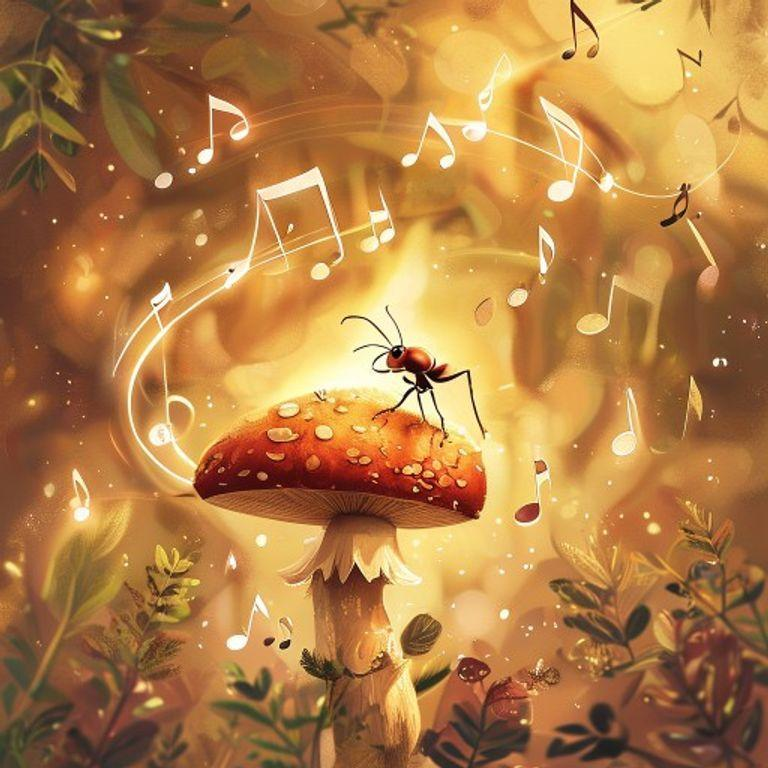
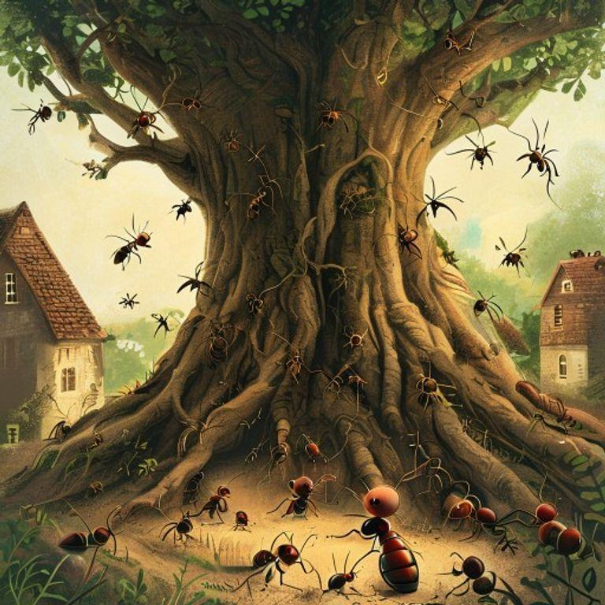
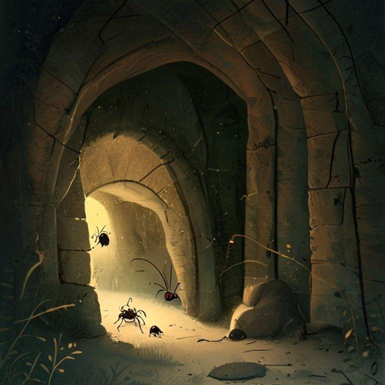
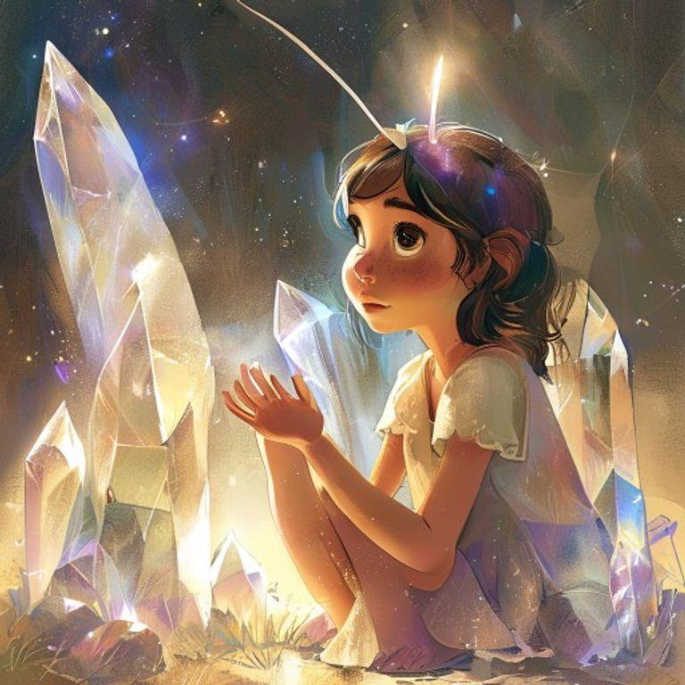
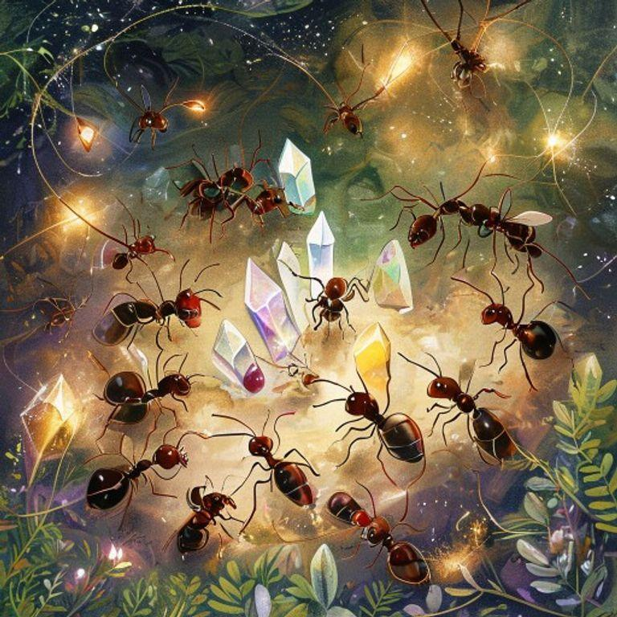
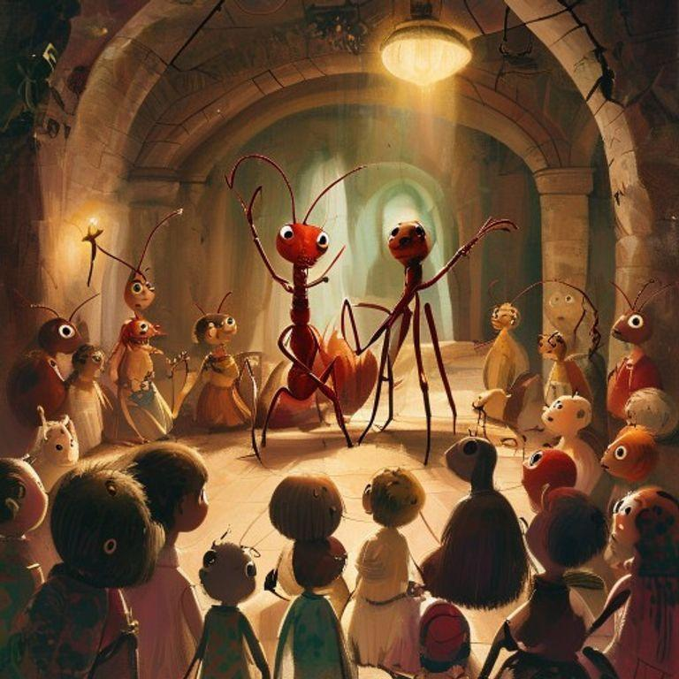
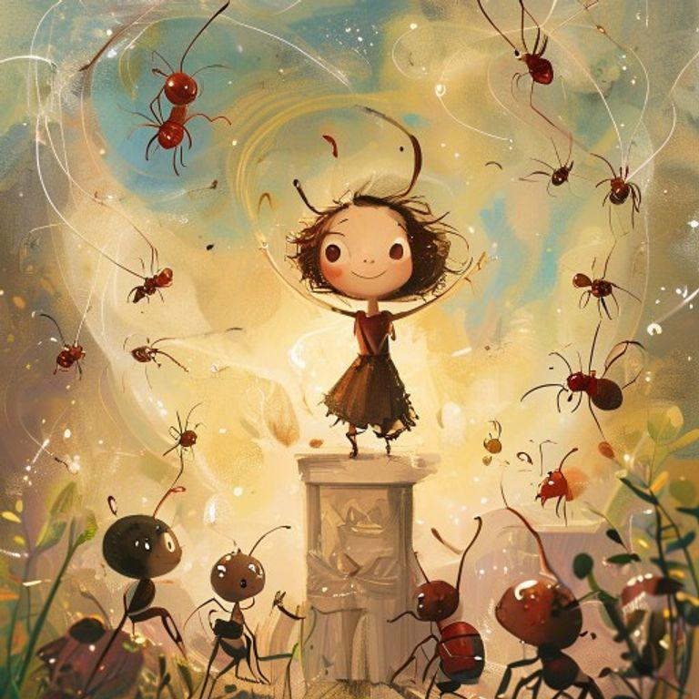

# The Ant Who Discovered the Symphony of the Earth

## Page 1

In a small village nestled between the roots of an ancient tree, there lived a tiny ant named Aria. Aria was different from the other ants, for she had a curious mind and a love for music.

## Page 2

One day, while out foraging for food, Aria stumbled upon a hidden underground chamber deep within the earth. The air inside was filled with a sweet, melodic hum that seemed to vibrate through every cell in her body.

## Page 3

As she explored the chamber, Aria found that the hum was coming from a series of glowing crystals embedded in the walls. Each crystal emitted a unique note, and when she touched them, the notes blended together in a beautiful harmony.

## Page 4

Aria spent hours in the chamber, experimenting with the crystals and creating her own music. She discovered that the earth itself was singing, and she was merely tuning in to its symphony.

## Page 5

As the days passed, Aria shared her discovery with the other ants, and soon they too were entranced by the symphony of the earth. Together, they created a new form of communication, using the music to convey messages and tell stories.

## Page 6

The ants' music attracted the attention of other creatures, and soon the chamber was filled with a diverse audience of beetles, worms, and even a curious rabbit or two.

## Page 7

Aria's discovery had brought the community together, and the ants' music became a symbol of their connection to the natural world. And Aria, the tiny ant who had once been different, was now celebrated as a hero and a visionary.

## Page 8

And so, Aria's story became a reminder that even the smallest creatures can make a big impact, and that the music of the earth is always there, waiting to be discovered.

