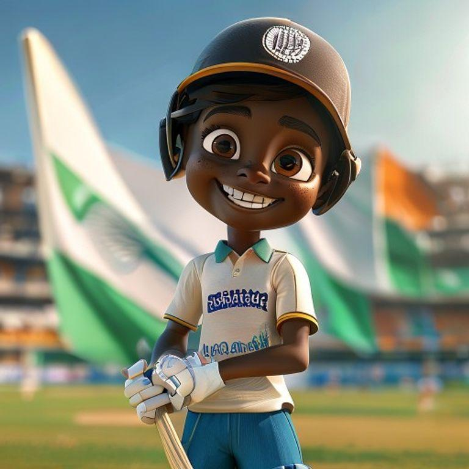
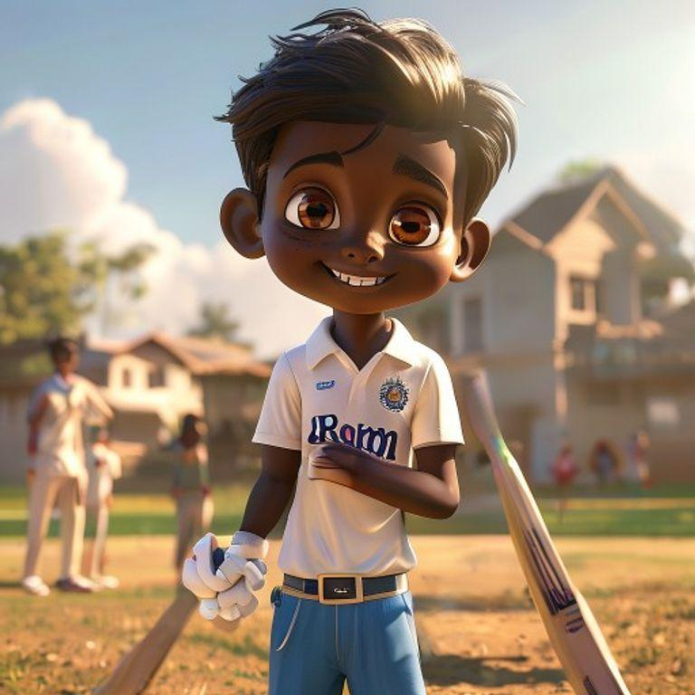
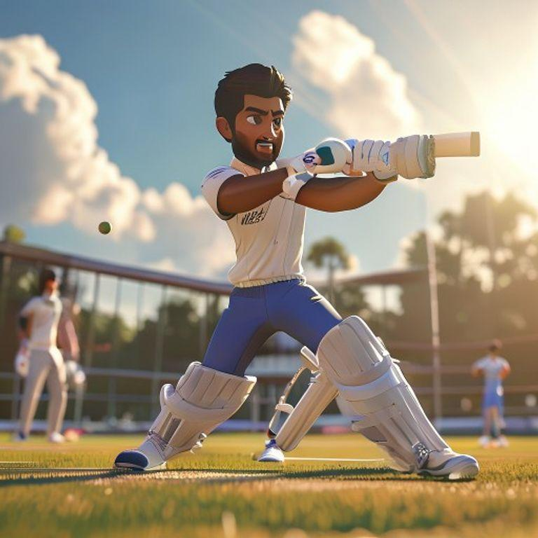
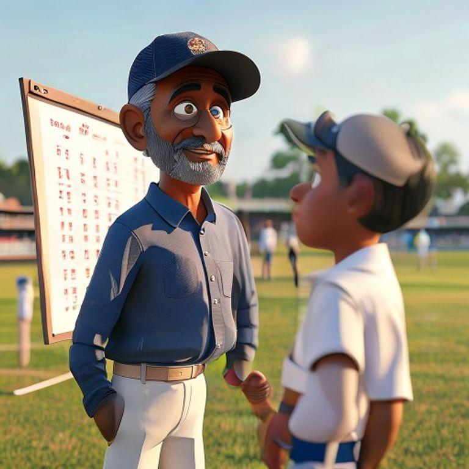
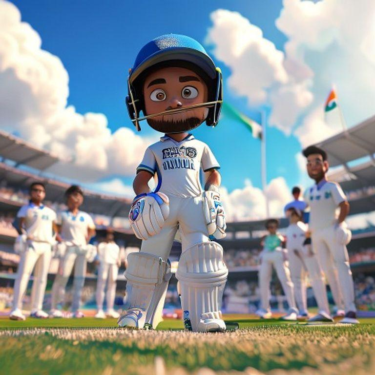
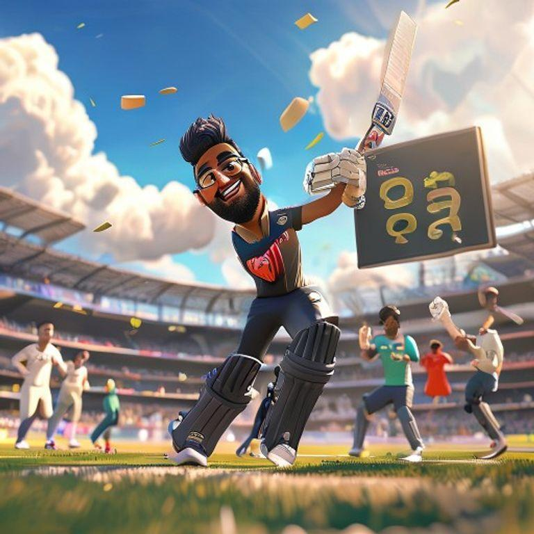
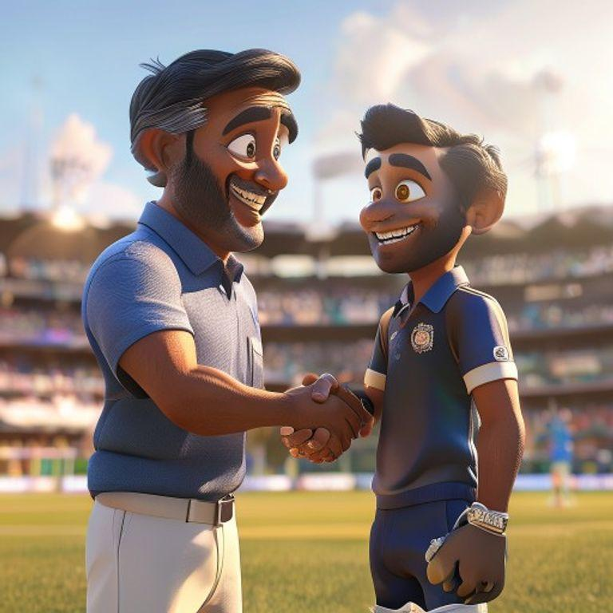
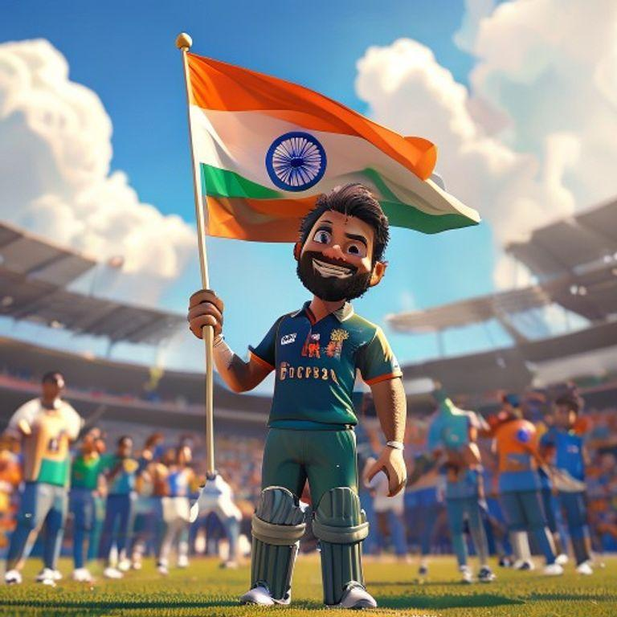
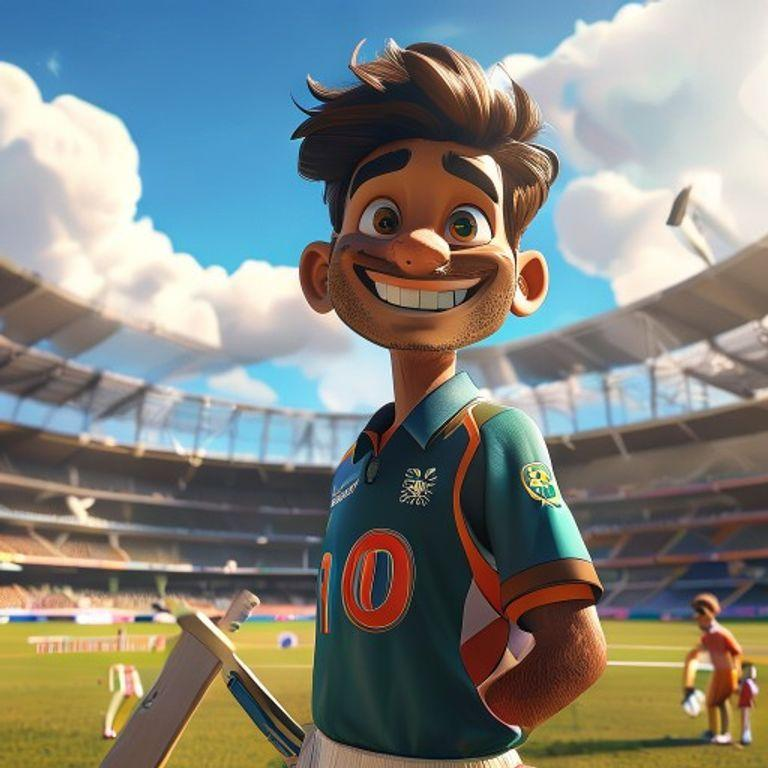

# The Little Master's Big Dream

## Page 1

In a small village in India, there lived a young boy named Rohan. He was known as the little master of cricket in his village. Rohan had a big dream - to play for the Indian cricket team one day.

## Page 2

Rohan practiced cricket every day, rain or shine. He would wake up early in the morning and practice his batting, bowling, and fielding. His hard work and dedication paid off, and soon he was selected to play for the state team.

## Page 3

As Rohan played more matches, he became a star player. He made many centuries and took many wickets. The crowd loved him, and he became known as the little master of cricket.

## Page 4

One day, Rohan received a call from the Indian cricket team's coach. They wanted him to join the team for an upcoming tournament. Rohan was over the moon with excitement.

## Page 5

Rohan worked hard and prepared himself for the tournament. He practiced his skills, watched videos of his opponents, and read books on cricket strategy.

## Page 6

The day of the tournament arrived, and Rohan was ready. He put on his Indian team jersey and walked onto the field with his teammates.

## Page 7

Rohan played a great match, scoring a century and taking a few wickets. The crowd cheered for him, and his teammates lifted him on their shoulders.

## Page 8

Rohan's dream had come true. He had become a part of the Indian cricket team and had made his country proud. He continued to work hard and play cricket with passion and dedication.

