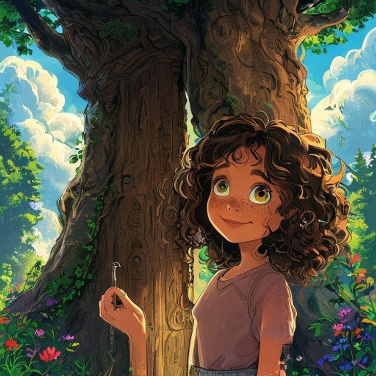
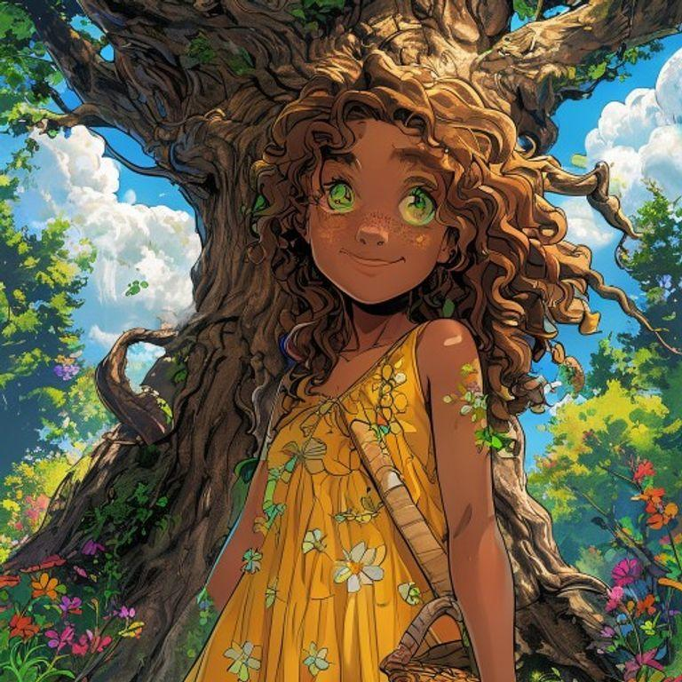
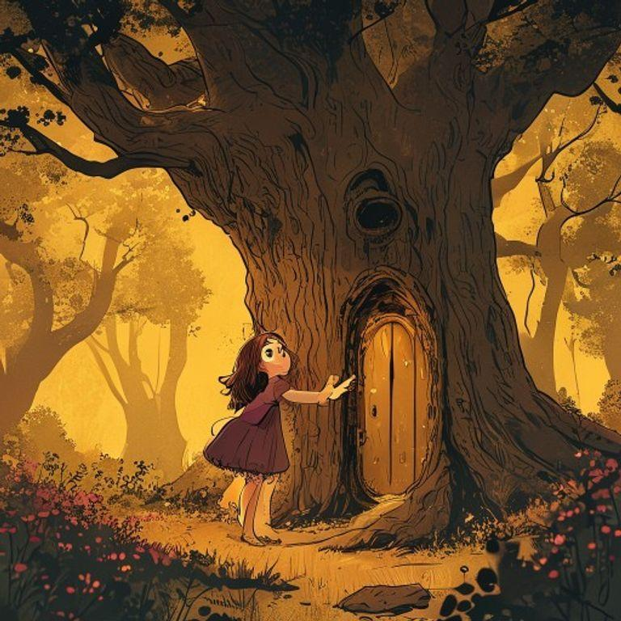
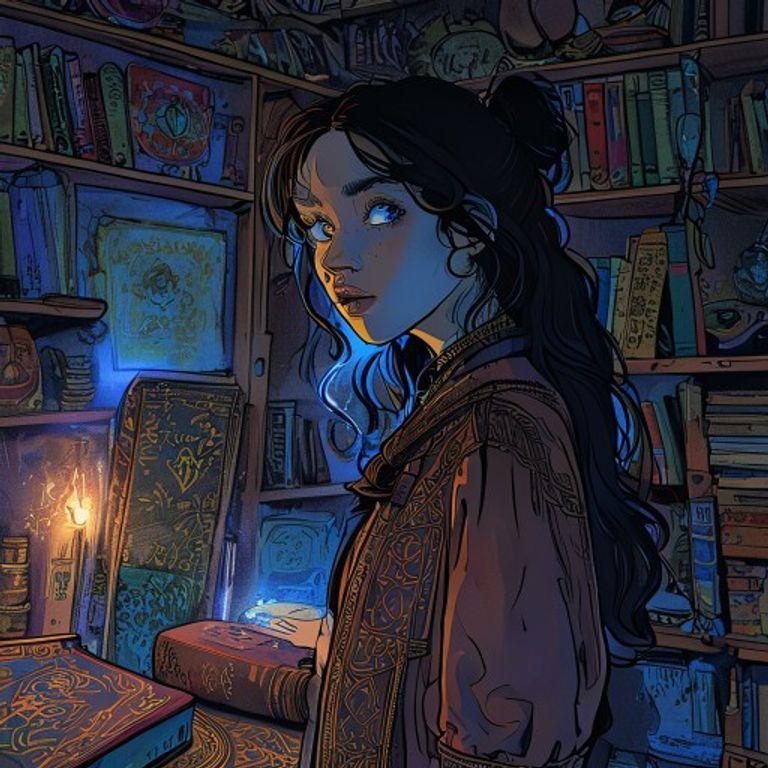
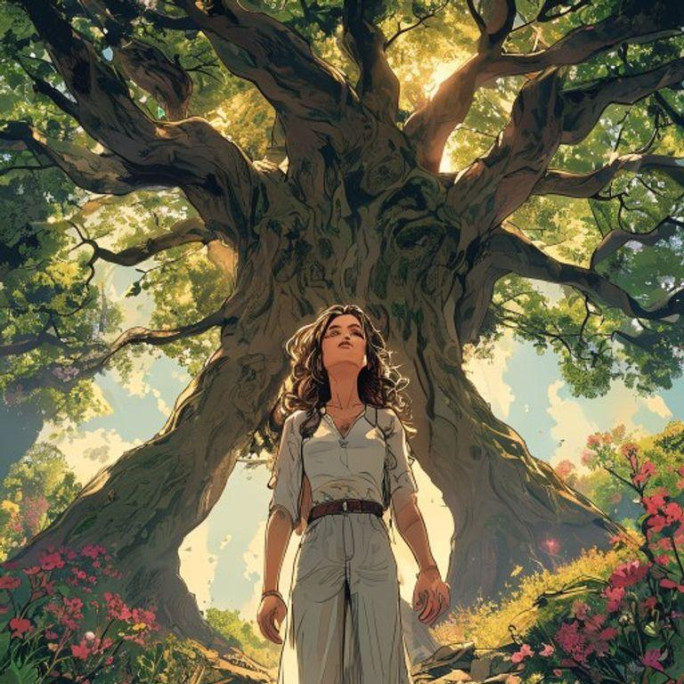
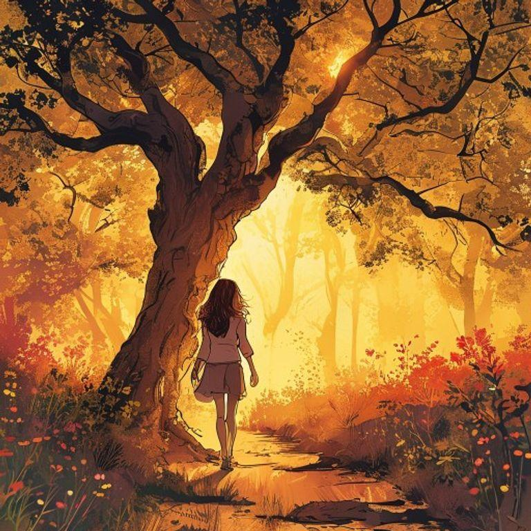
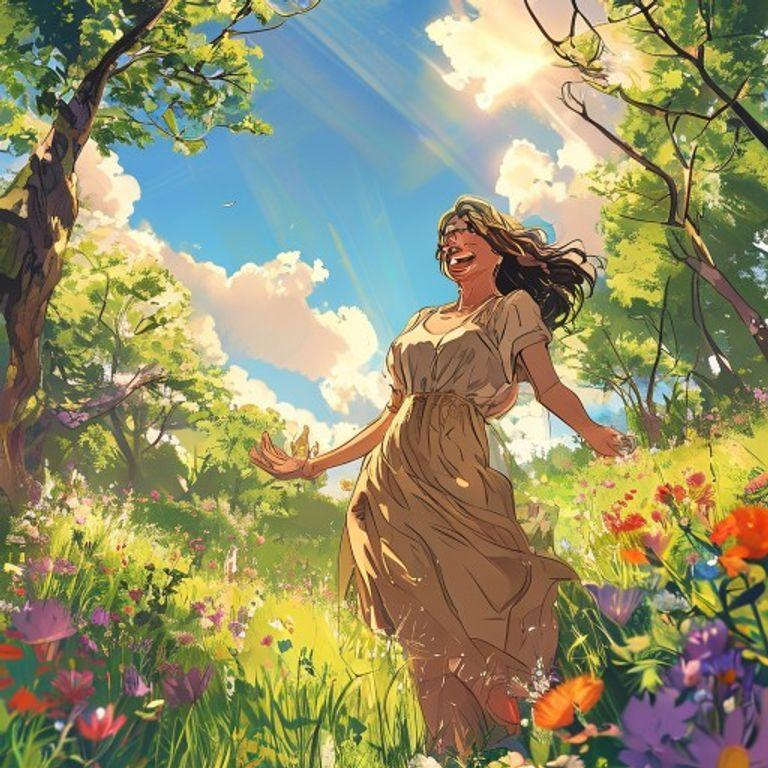
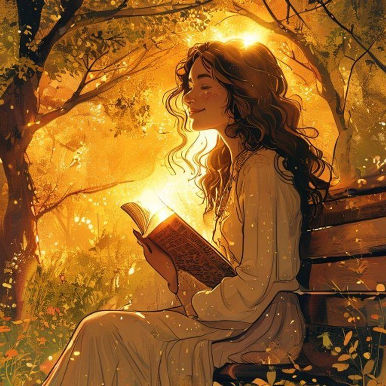

# The Luminous Truth

## Page 1

In a small village nestled in the heart of a dense forest, there lived a young girl named Luna. She had curly brown hair, bright green eyes, and a warm smile that could light up the darkest of rooms. Luna loved to explore the forest, discovering hidden streams and secret meadows, and she was especially fascinated by the ancient trees that seemed to hold secrets and stories of their own.

## Page 2

One day, while wandering through the forest, Luna stumbled upon a hidden clearing. In the center of the clearing stood an enormous tree, its trunk twisted and gnarled with age. Carved into the trunk was a small door, adorned with intricate patterns and symbols that seemed to shimmer and glow in the fading light.

## Page 3

Luna's curiosity got the better of her, and she pushed the door open, revealing a cozy room filled with strange and wondrous objects. There were glowing crystals, shimmering fabrics, and mysterious devices that whirred and hummed with a soft, blue light. In the center of the room, a small, delicate table held a single, leather-bound book.

## Page 4

As Luna opened the book, she discovered that it was filled with stories and secrets, each one more amazing and incredible than the last. But as she delved deeper into the book, she began to realize that not all of the stories were true. Some were lies, told to deceive and manipulate, while others were half-truths, told to conceal and distort.

## Page 5

Luna felt a weight settling upon her, as she realized the power of words and the danger of lies. She knew that she had to make a choice, to either continue down the path of deception, or to seek out the truth, no matter how difficult or challenging it might be. As she closed the book, the room around her began to fade away, and she found herself back in the forest, standing in front of the ancient tree.

## Page 6

As she walked away from the tree, Luna felt a sense of freedom and release, like she had been unburdened of a great weight. She knew that she would always carry the lessons of the book with her, and that she would always strive to seek out the truth, no matter how difficult or challenging it might be. And as she disappeared into the forest, the tree seemed to nod its branches in approval, as if it knew that Luna had finally found the luminous truth.

## Page 7

From that day on, Luna lived her life with a newfound sense of purpose and direction. She sought out the truth, no matter how difficult or challenging it might be, and she always strived to be honest and authentic in her words and actions. And as she grew and flourished, the forest around her seemed to grow and flourish as well, filled with a vibrant, luminous energy that seemed to emanate from Luna herself.

## Page 8

And so, Luna's story came full circle, as she learned the value of honesty and authenticity, and the freedom that comes from seeking out the truth. She lived a long and happy life, filled with wonder and adventure, and she always remembered the lessons of the book, and the luminous truth that had set her free.

