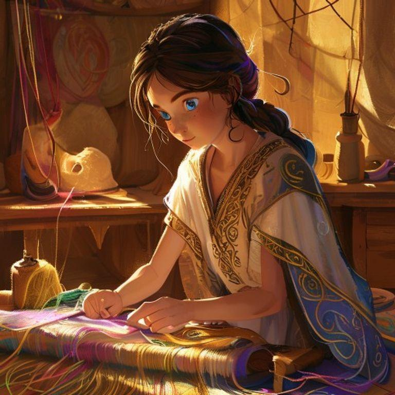
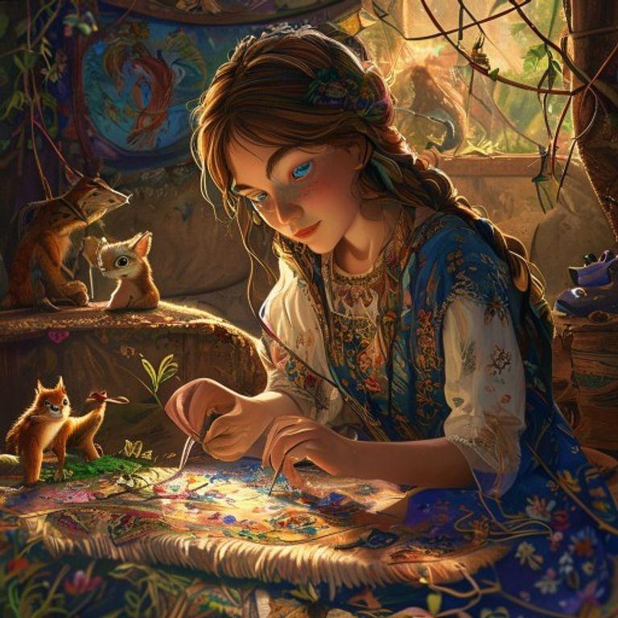
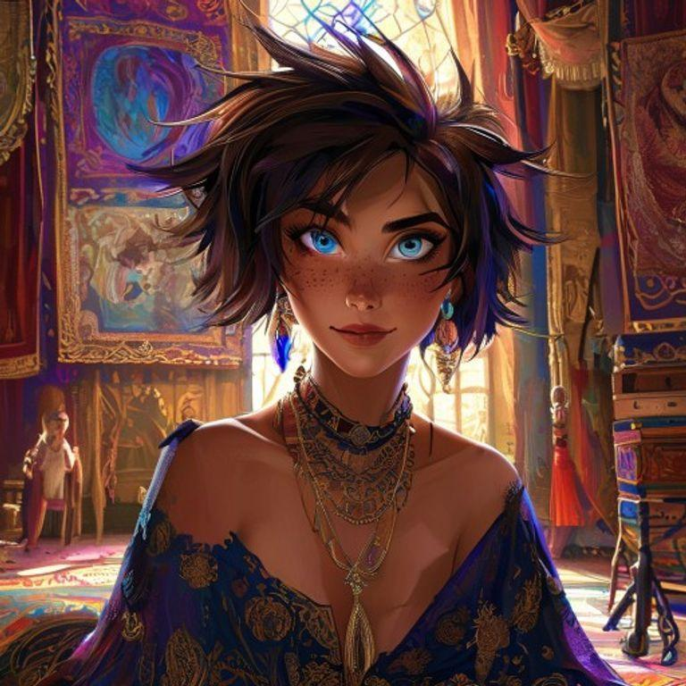

# The Dreamweaver's Tapestry

## Page 1

In the world of Somnium, dreams were not just fleeting visions of the subconscious, but tangible fabrics that could be woven, worn, and even lived in. The dreamweavers, skilled artisans with the ability to craft and shape these fabrics, were highly revered for their talents. Among them was a young dreamweaver named Lyra, with short, spiky hair the color of dark chocolate and bright blue eyes that sparkled like the stars on a clear night.

## Page 2

Lyra's latest commission was a mysterious tapestry, woven from the dreams of a reclusive client. The fabric shimmered with an otherworldly glow, and Lyra could feel the power of the dreams emanating from it. As she worked, she began to notice strange occurrences – threads would move on their own, and the fabric would ripple as if it were alive.

## Page 3

One night, as Lyra worked late in her studio, the tapestry suddenly burst into life. The fabric unfolded like a map, revealing a fantastical landscape of rolling hills, towering mountains, and shimmering lakes. Lyra felt herself being drawn into the tapestry, as if she were being pulled into the very fabric of the dreams.

## Page 4

As Lyra stepped into the tapestry, she found herself in a world unlike any she had ever known. The air was sweet with the scent of blossoming flowers, and the sky was a deep, burning crimson. She wandered through the landscape, marveling at the wonders that surrounded her – towering trees with trunks as wide as houses, and creatures that defied explanation.

## Page 5

But as Lyra explored the world of the tapestry, she began to realize that something was amiss. The creatures that inhabited this world were not as they seemed, and the landscape itself was beginning to unravel. Lyra knew that she had to find a way to repair the tapestry, before the very fabric of the dreams was torn apart.

## Page 6

With her needle and thread, Lyra set out to repair the tapestry. She worked tirelessly, weaving the threads back together and restoring the fabric to its former glory. As she worked, the world of the tapestry began to heal, the creatures returning to their natural forms and the landscape repairing itself.

## Page 7

Finally, after many long hours, the tapestry was complete. Lyra stepped back to admire her handiwork, feeling a sense of pride and accomplishment. The fabric shimmered with an otherworldly glow, and Lyra knew that she had truly mastered the art of dreamweaving.

## Page 8

From that day on, Lyra was known as the greatest dreamweaver of all time. Her tapestries were sought after by kings and queens, and her name became synonymous with the art of dreamweaving. And Lyra, the young dreamweaver with a passion for the unknown, lived happily ever after, her threads weaving the very fabric of reality.

