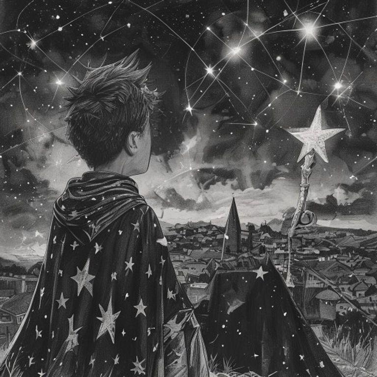
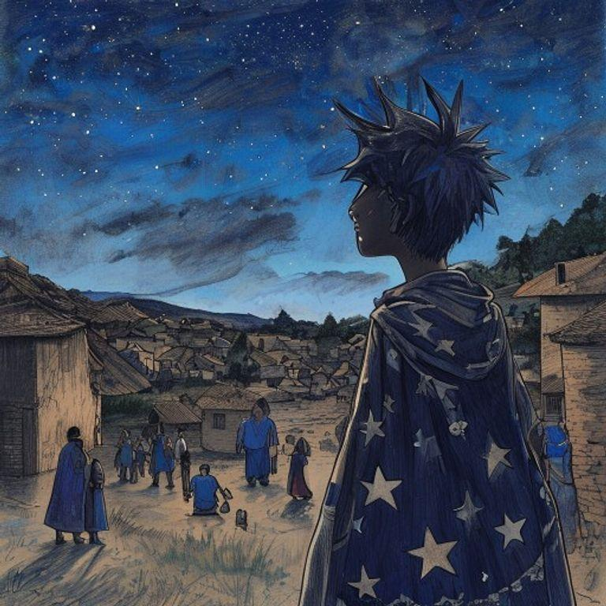
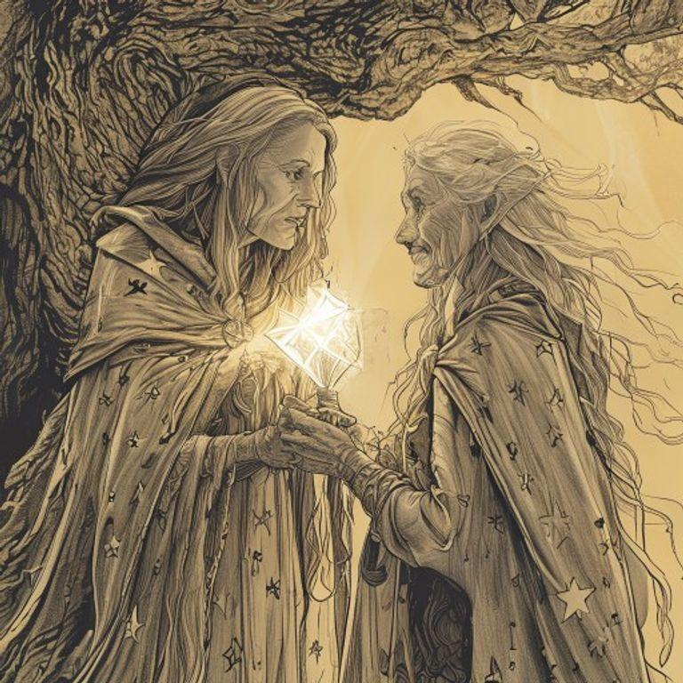
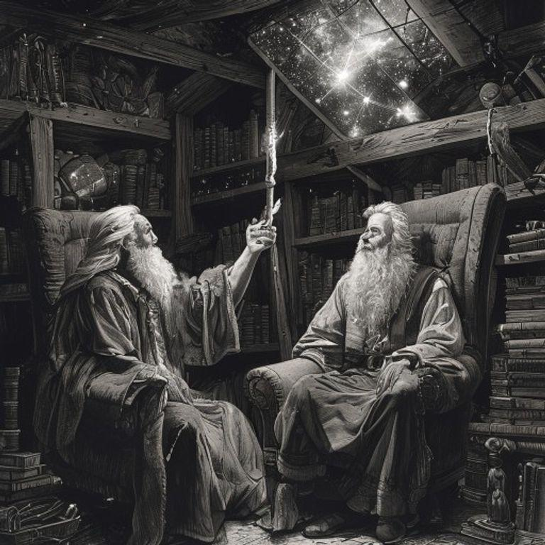
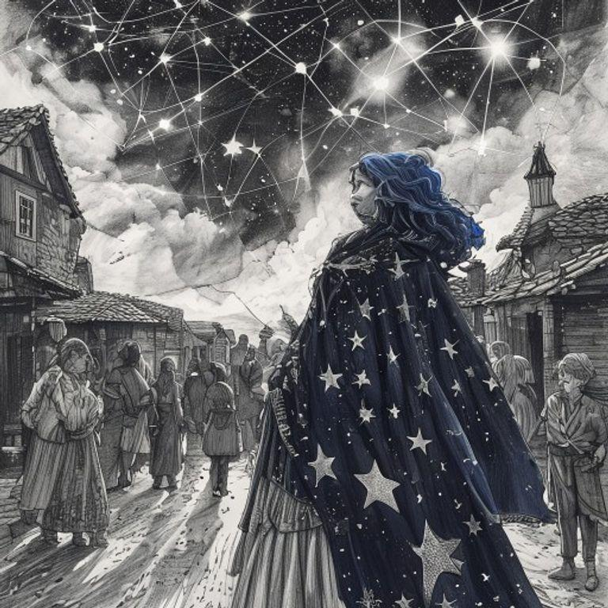
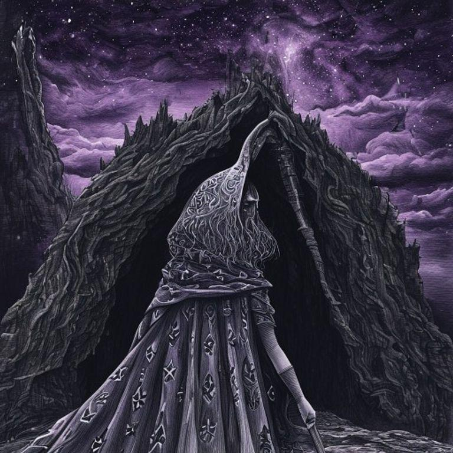
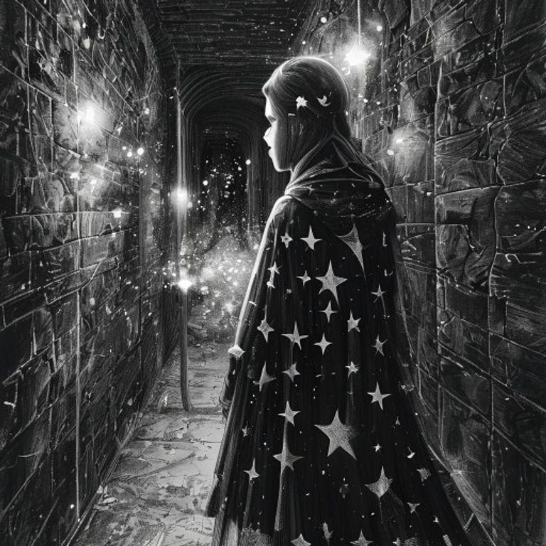
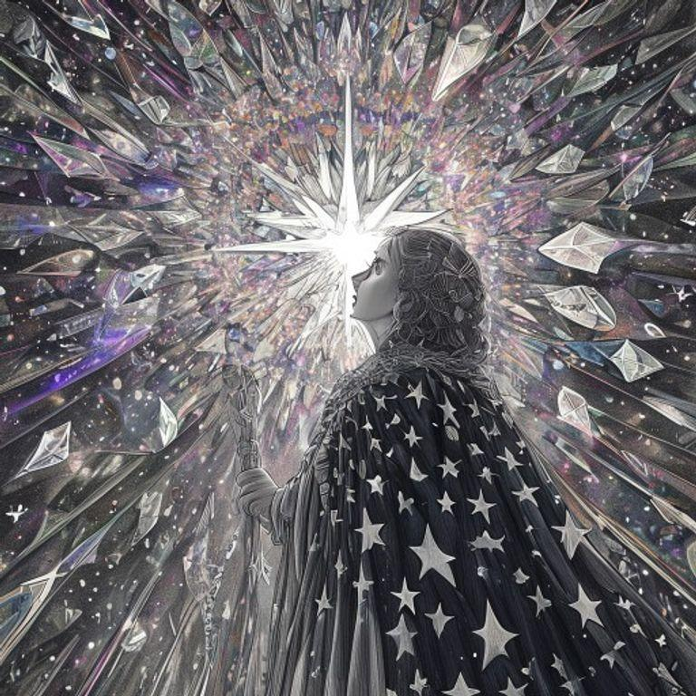
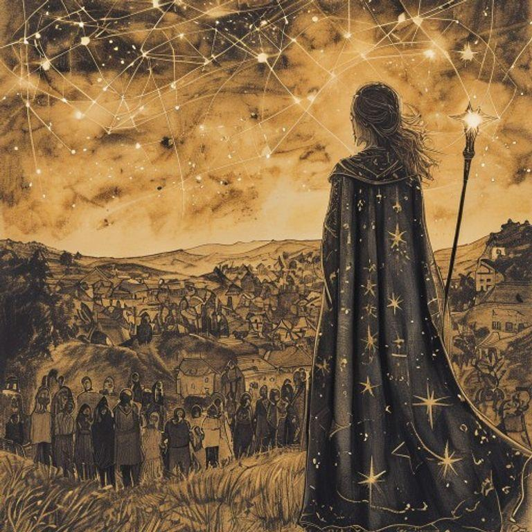

# The Starkeeper's Quest: Mending the Celestial Tapestry

## Page 1

In the village of Luminaria, memories took on a life of their own, manifesting as intricate, glowing constellations in the night sky. The villagers believed that as long as their memories shone bright, their identities remained strong. But when memories began to fade, the villagers' sense of self started to unravel.

## Page 2

Astra, the young starkeeper, felt the weight of responsibility on her shoulders. She had inherited the ancient art of mending the celestial tapestry from her wise and aged mentor, Nova. With her trusty staff in hand, Astra set out to repair the fractured memories that threatened to erase the villagers' identities.

## Page 3

Astra's first stop was the home of the village elder, Orion. His memories of the village's founding had begun to fade, causing him to forget the stories of his ancestors. Astra used her staff to reach up to the stars and gently nudge the fractured constellation back into place.

## Page 4

As Astra traveled from house to house, mending the celestial tapestry, the villagers began to remember their stories and traditions. They smiled and laughed, their eyes shining with a renewed sense of purpose.

## Page 5

But not all memories were easy to mend. Some were tangled and knotted, refusing to be repaired. Astra encountered a dark and foreboding constellation that seemed to be draining the light from the surrounding stars.

## Page 6

With a deep breath, Astra stepped into the heart of the darkness. She found herself in a labyrinth of twisted corridors and dark chambers, each one filled with the whispers of forgotten memories.

## Page 7

At the heart of the labyrinth, Astra discovered a great, glowing crystal that pulsed with the power of the celestial tapestry. With a surge of confidence, she reached out and touched the crystal, channeling its energy into the fractured memories.

## Page 8

As the darkness receded, the villagers' memories were restored, and their identities shone brighter than ever before. Astra, the young starkeeper, had saved the celestial tapestry, ensuring that the stories and traditions of Luminaria would never be forgotten.

