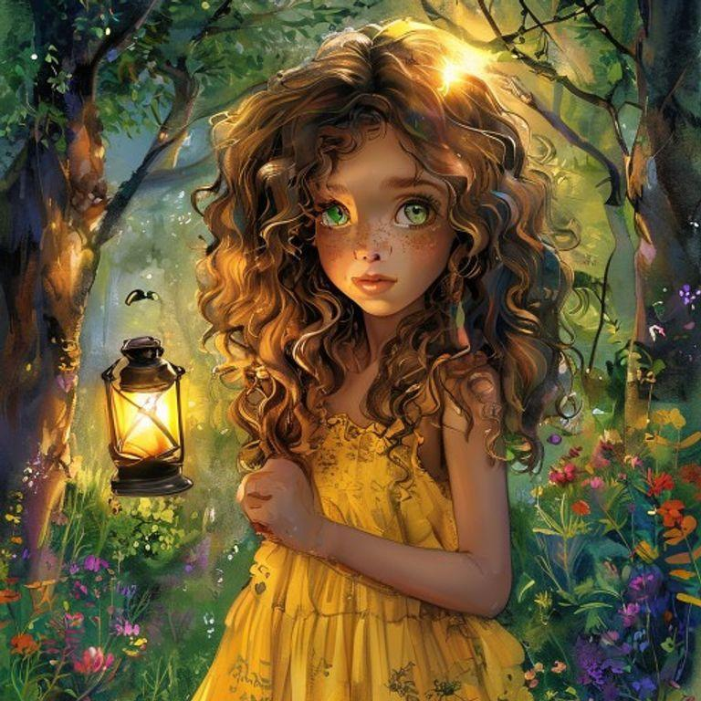
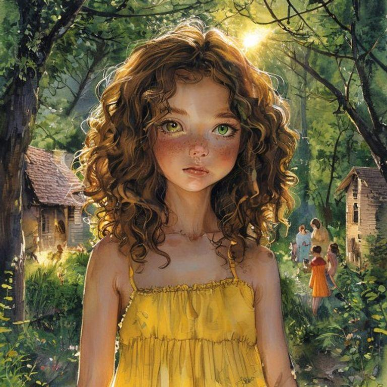
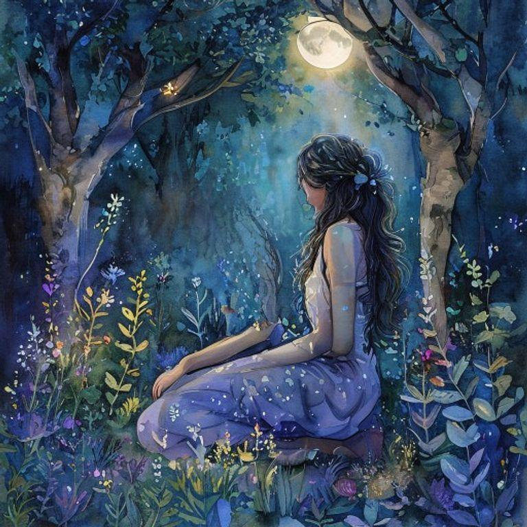
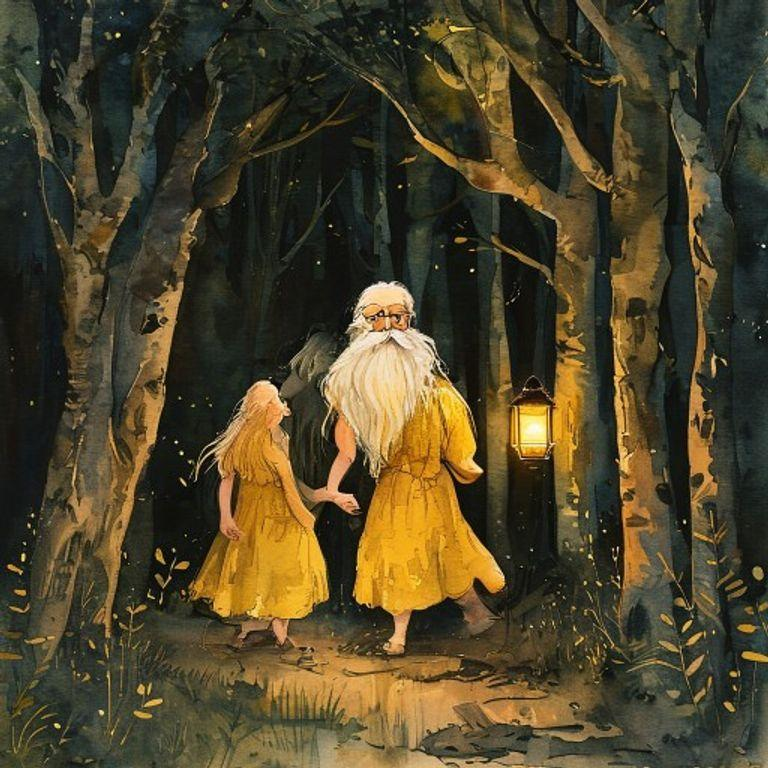
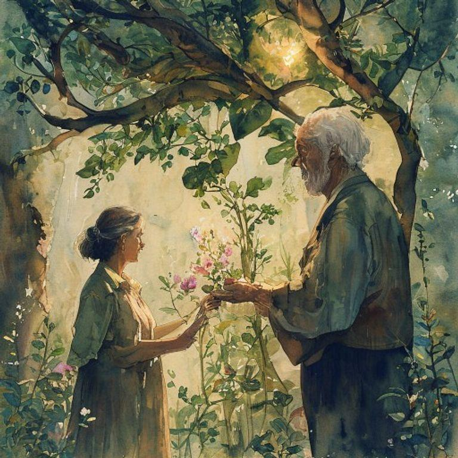
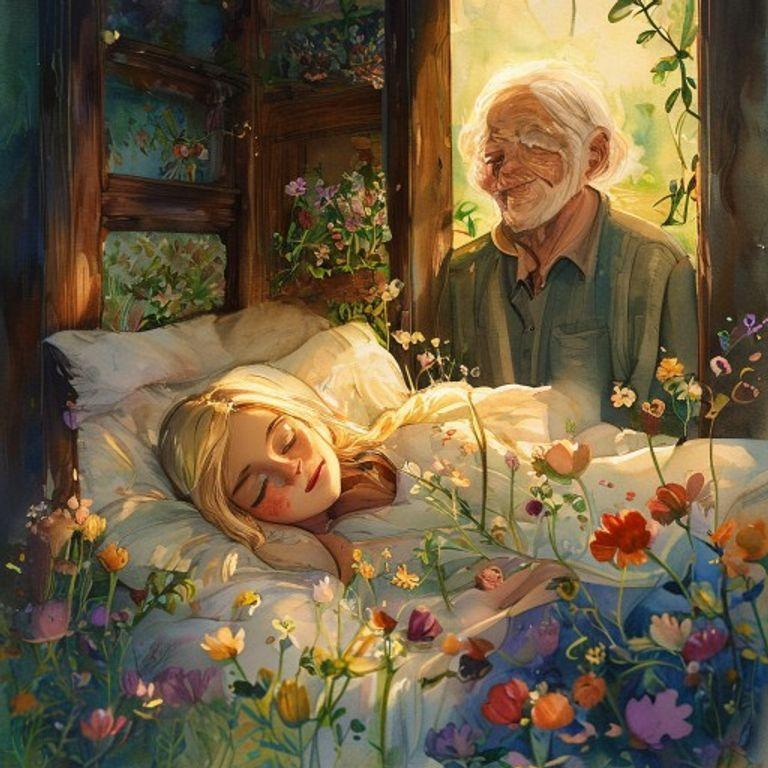
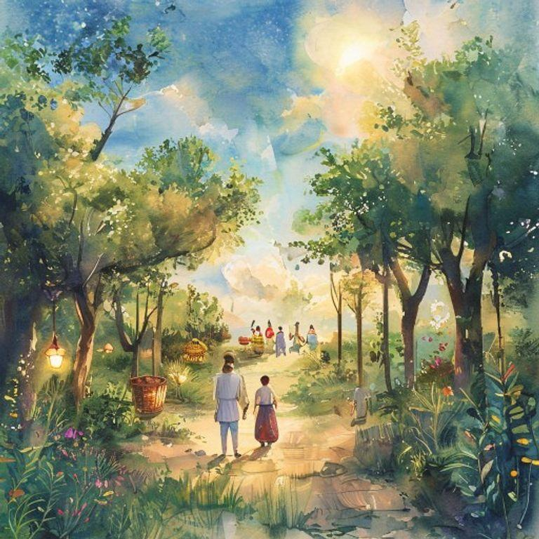
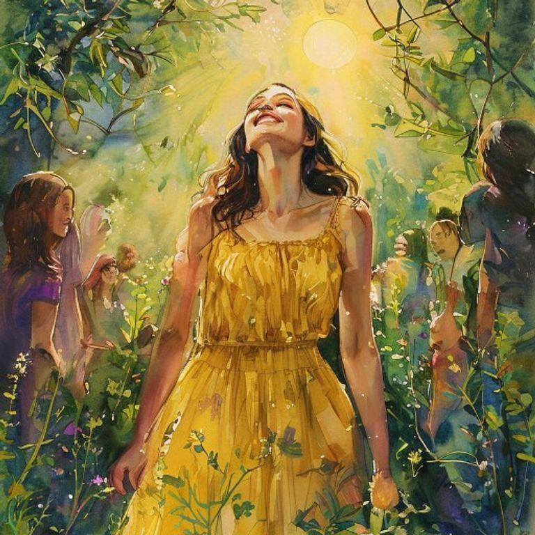
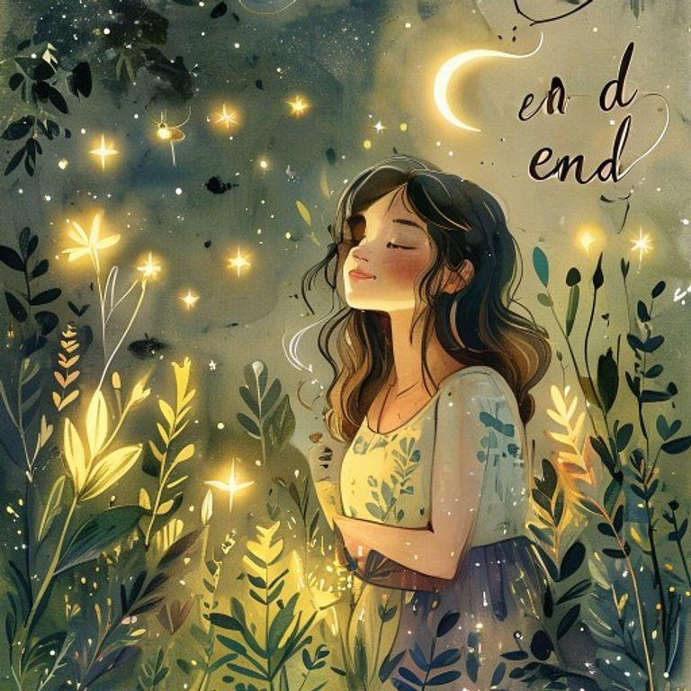

# The Shadow Gardener's Gift

## Page 1

In a world where shadows have their own secret gardens, a young shadow gardener named Luna lived in a small village surrounded by a dense forest. Luna had curly brown hair and bright green eyes that sparkled with excitement whenever she talked about her garden. She wore a yellow sundress with white flowers embroidered on the hem, and her feet were always bare, as if ready to dance into the shadows at any moment.

## Page 2

Luna's garden was hidden deep within the forest, where the trees grew tallest and the shadows were darkest. She would spend hours every day tending to the mysterious plants that bloomed in the darkness, nurturing them with love and care. The plants were unlike any others, for they absorbed the darkness and produced light, which Luna would then harvest and use to help those in need.

## Page 3

One day, a wise old man came to the village, seeking Luna's help. His granddaughter, a young girl named Aria, had fallen ill, and the old man had heard that Luna's garden held the key to her recovery. Luna agreed to help, and together they set out into the forest, carrying a small lantern to light their way.

## Page 4

As they walked, the trees grew taller, and the shadows deepened, until they reached the heart of Luna's garden. There, a magnificent plant with leaves that shone like stars and flowers that bloomed in shades of pink and gold, stood tall, radiating a warm, gentle light. Luna plucked a few of the flowers, and the old man took them, thanking her for her kindness.

## Page 5

The old man took the flowers to Aria, who was lying in bed, her face pale and her eyes sunken. He gave her the flowers, and she inhaled their sweet fragrance, feeling a warmth spread through her body. As she breathed in the light from the flowers, her eyes began to sparkle, and her face regained its color, and she smiled, feeling the darkness lift from her heart.

## Page 6

From that day on, Aria recovered, and the village prospered, thanks to Luna's garden and the light it brought to those who needed it most. Luna continued to tend to her garden, nurturing the mysterious plants, and harvesting their light, which she would then share with the world, spreading hope and joy wherever she went.

## Page 7

As the years passed, Luna's garden became a beacon of hope, attracting people from all over the world, who came to marvel at its beauty and bask in its light. And Luna, the young shadow gardener, remained at its heart, nurturing the plants, and spreading joy and wonder wherever she went, her curly brown hair and bright green eyes shining like a ray of sunshine in the darkness.

## Page 8

And so, Luna's story came full circle, as she continued to tend to her garden, spreading light and joy to all those who needed it, reminding everyone that even in the darkest of times, there is always hope, and that with love, care, and nurturing, even the most mysterious and magical of plants can bloom, bringing light to a world that often needs it most.

