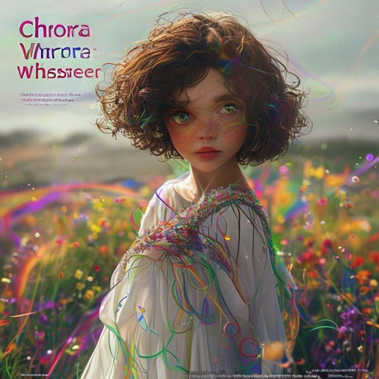
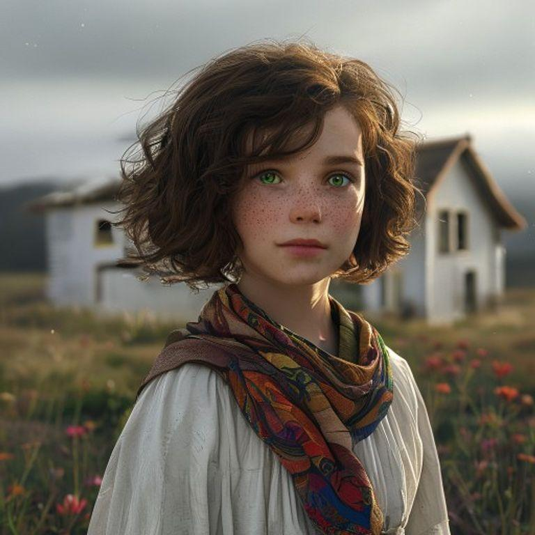
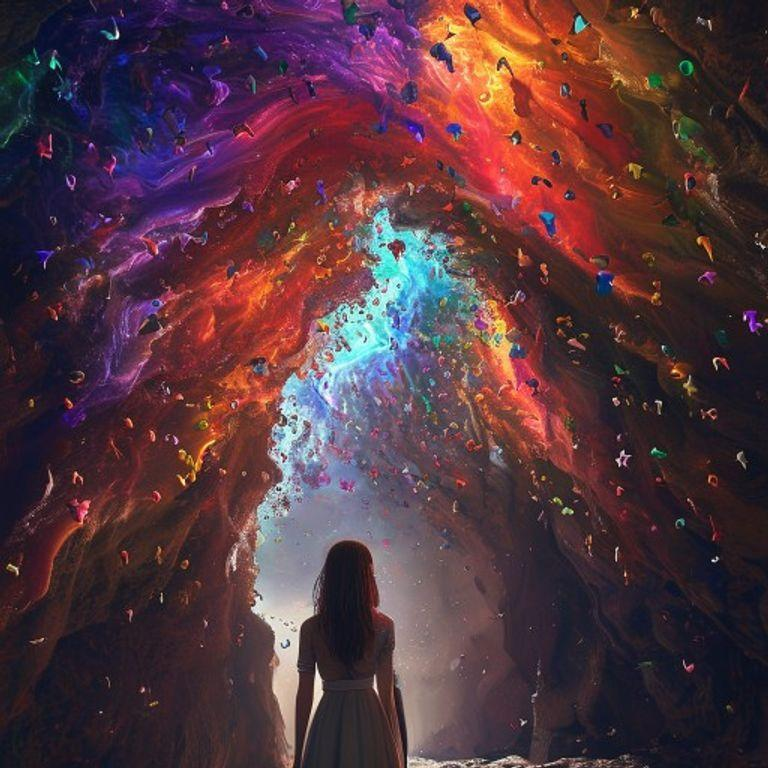
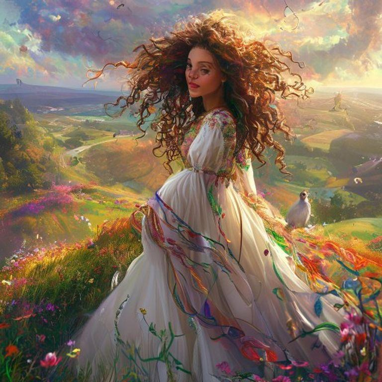
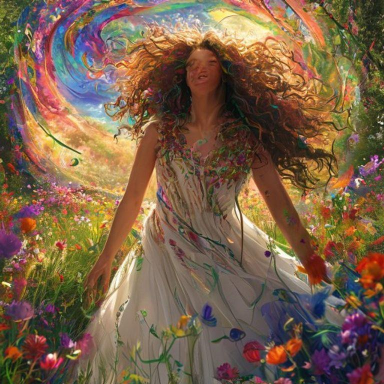

# The Shadow Storykeepers

## Page 1

In a world beyond our own, where stories were the very fabric of reality, the silhouettes of forgotten tales came to life as delicate paper cutouts. These fragile figures roamed a mystical realm, searching for a way back to their rightful places within the stories that had given them life. It was here that a young narrative navigator named Luna lived, tasked with guiding these lost characters back to their tales to revive the magic of storytelling.

## Page 2

Luna's journey began in a small, cozy village on the outskirts of the mystical realm. The villagers, who were also narrative navigators, had been training Luna in the art of storytelling and the magic of guiding lost characters back to their tales. With her trusty wand and leather-bound book by her side, Luna set out into the unknown, ready to face whatever challenges lay ahead.

## Page 3

As Luna traveled through the mystical realm, she encountered all manner of forgotten characters, each one more fascinating than the last. There was a swashbuckling pirate, a clever detective, and even a misunderstood monster, all searching for a way back to their stories. Luna used her wand and book to guide them, carefully navigating the twists and turns of the realm to find the perfect tale for each character.

## Page 4

But Luna's journey was not without its challenges. A dark force, known only as the Shadow, threatened to destroy the mystical realm and all the forgotten characters within it. The Shadow was a dark, formless mass that seemed to have a life of its own, and it would stop at nothing to prevent Luna from guiding the characters back to their tales.

## Page 5

Despite the dangers, Luna pressed on, using her wand and book to guide the characters back to their tales. With each success, the mystical realm grew stronger, and the Shadow grew weaker. The characters, once forgotten, were now remembered, and their stories were once again alive and vibrant.

## Page 6

But the Shadow was not so easily defeated. It launched a final, desperate attack on Luna and the characters, seeking to destroy the mystical realm and all the stories within it. Luna, with her wand and book, stood ready to face the Shadow, determined to save the realm and all its inhabitants.

## Page 7

With a wave of her wand and a whispered spell, Luna summoned the power of the stories themselves to aid her in the battle against the Shadow. The characters, now remembered and alive, used their unique skills and abilities to help Luna defeat the Shadow and save the mystical realm.

## Page 8

And so, with the Shadow defeated and the mystical realm saved, Luna returned to the village, hailed as a hero by the narrative navigators and the characters she had guided back to their tales. The stories, once forgotten, were now alive and vibrant, and the mystical realm was once again a place of wonder and magic.

