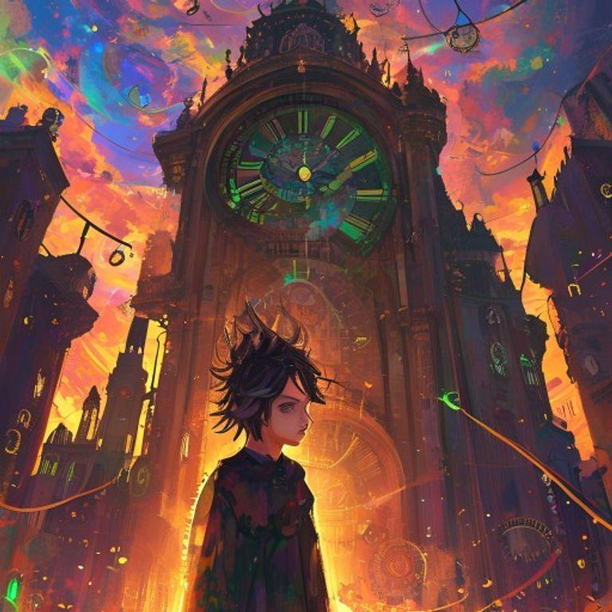
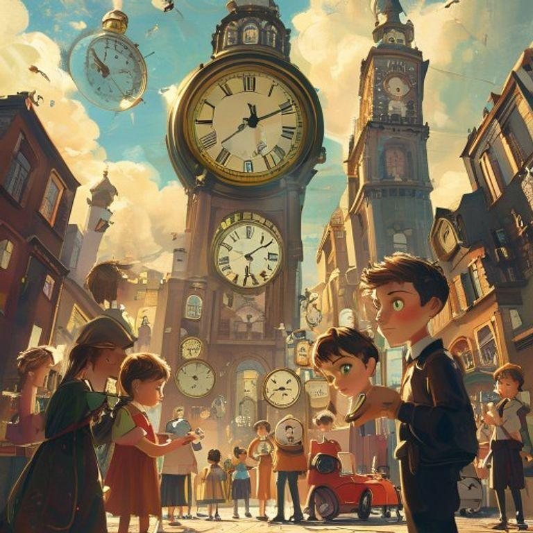

# The Time Thief's Dilemma

## Page 1

In the city of Chronos, time was currency. People traded years of their lives for material possessions, and the rich lived forever. But there was a hidden market, where memories were stolen and sold. That's where our story begins, with a young time thief named Kael.

## Page 2

Kael was known for his skills in the hidden market. He could steal memories from anyone, without them even realizing it. But tonight, he was on a mission to steal a specific memory, one that could change his life forever.

## Page 3

Kael navigated the crowded streets, avoiding the city guards and making his way to the hidden market. It was a secret place, hidden behind a waterfall in an abandoned park. Only those who knew the password could enter.

## Page 4

As Kael entered the hidden market, he was greeted by the market's owner, an old woman with long, silver hair and piercing blue eyes. She was known as the Timekeeper, and she controlled the flow of memories in the market.

## Page 5

The Timekeeper looked at Kael with a knowing glance. 'You're here for the memory of the first sunrise,' she said. 'It's a rare and precious memory, one that could change your life forever.'

## Page 6

Kael nodded, his heart racing with excitement. He had been searching for this memory for years, and he was willing to do anything to get it. The Timekeeper smiled, and handed him a small, delicate vial filled with a glowing liquid.

## Page 7

As Kael drank the liquid, the memory of the first sunrise flooded his mind. He saw the world in a new light, with colors and sounds that he had never experienced before. It was a truly magical moment, one that changed his life forever.

## Page 8

From that day on, Kael was a changed person. He used his skills to help others, stealing memories that were painful or traumatic, and replacing them with happy ones. He became known as the Time Thief, a hero in the hidden market.

