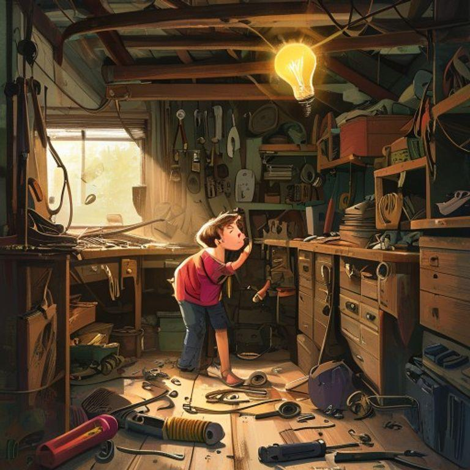

# The Curious Mind of Max

## Page 1

Once upon a time, in a world full of wonder, there lived a boy named Max. Max was a very special boy, with a mind full of curiosity and a heart full of kindness.

## Page 2

Max loved to read books and learn new things. He spent most of his free time in the library, devouring books on science, history, and technology.

## Page 3

One day, while browsing through a book on robotics, Max had an idea. He decided to build his own robot, using scraps and parts he found around the house.

## Page 4

With the help of his trusty toolkit and a lot of trial and error, Max built a robot that could move, talk, and even do chores for him.

## Page 5

Max named his robot 'Zeta' and the two quickly became inseparable. Zeta helped Max with his homework, cleaned his room, and even assisted him in the kitchen.

## Page 6

As news of Max's incredible robot spread, people from all over the city came to visit him and learn from his creation.

## Page 7

Max realized that his curiosity and creativity had not only improved his own life but also inspired others to pursue their passions and dreams.

## Page 8

And from that day on, Max continued to explore, invent, and innovate, always remembering that with great curiosity comes great possibility.

