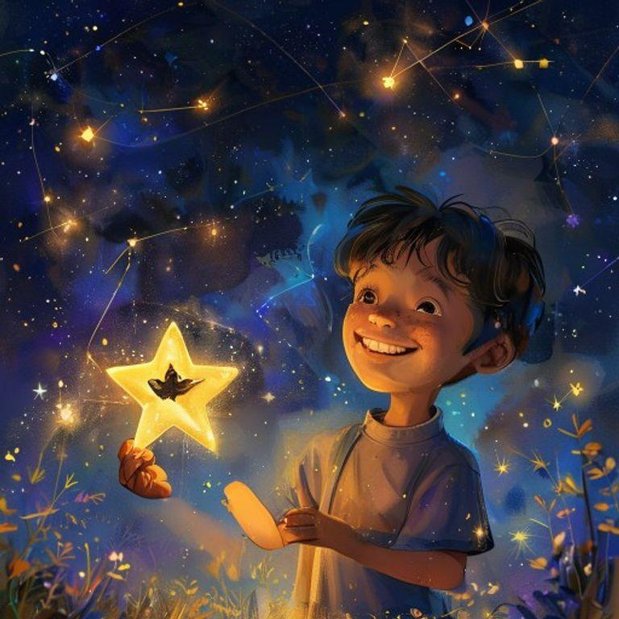
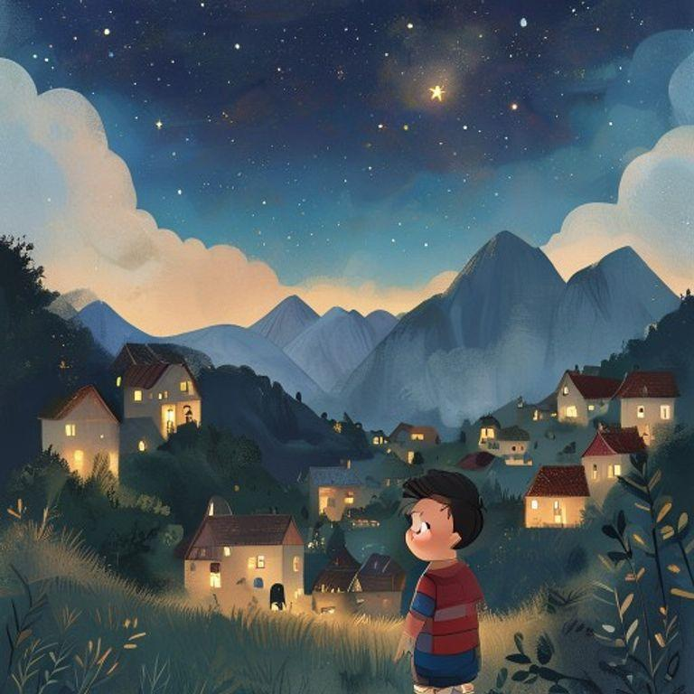
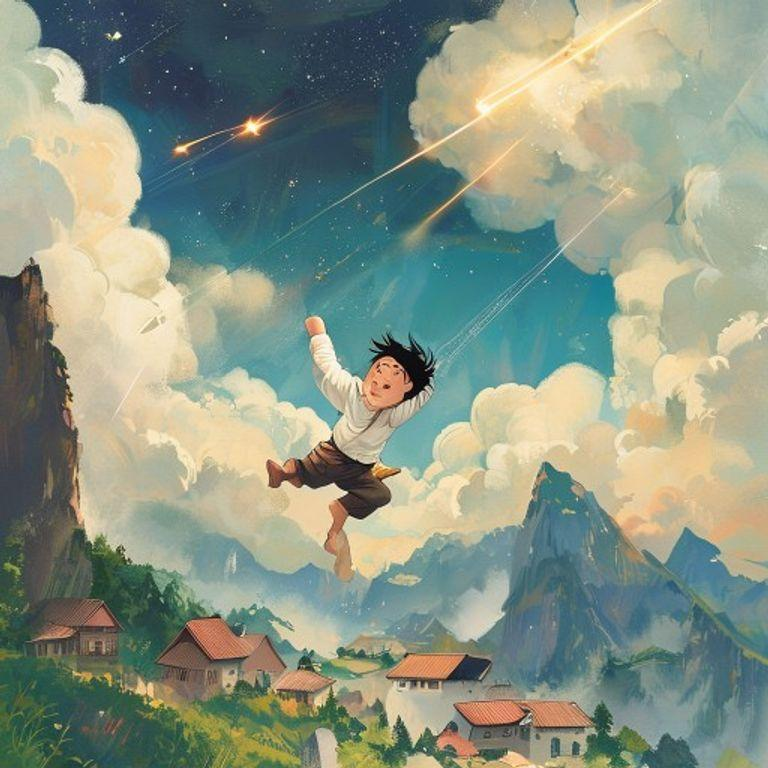
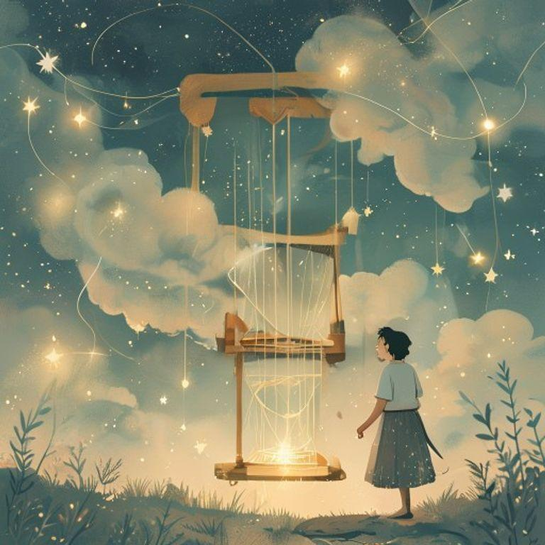
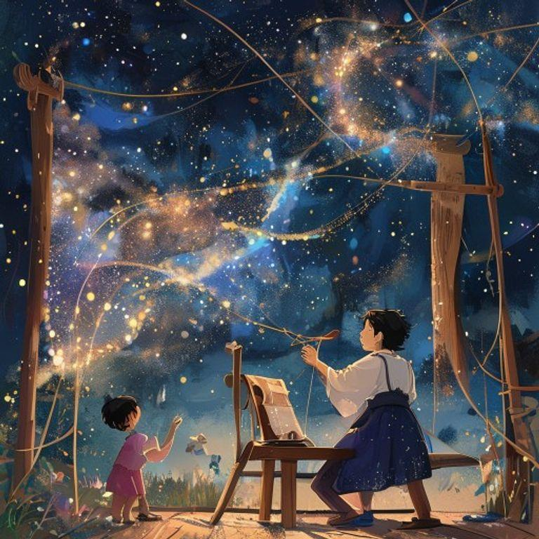
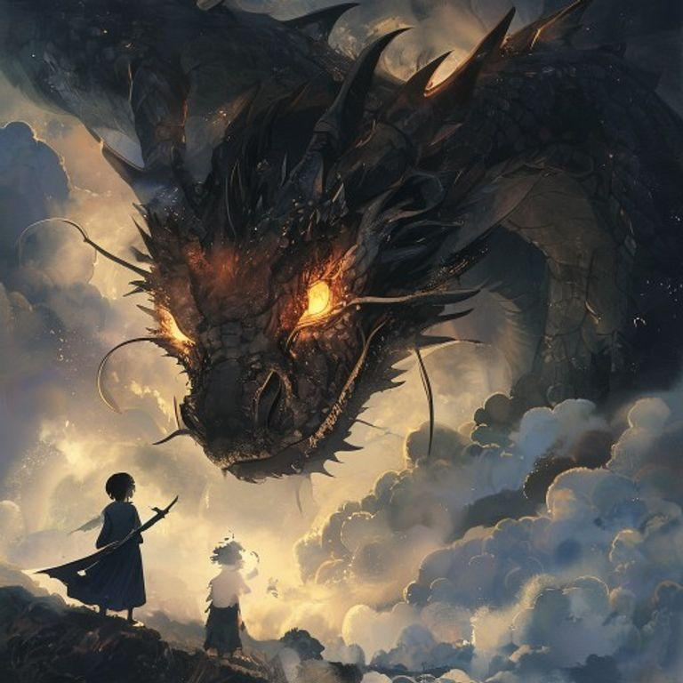
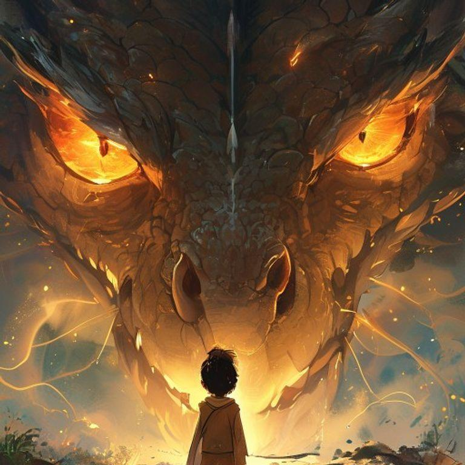
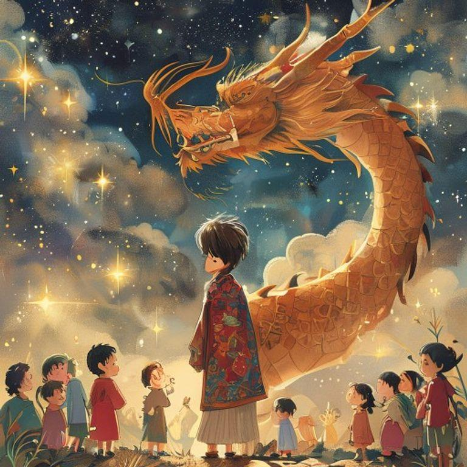

# The Starlight Weaver

## Page 1

Once upon a time, in a small village nestled between two great mountains, there lived a boy named Kaito. Kaito was an ordinary boy, or so it seemed. He loved to explore the world around him, but he had a secret: he could hear the whispers of the stars.

## Page 2

One night, as Kaito was gazing up at the stars, he heard a soft whisper in his ear. 'Kaito, we need your help.' The voice was gentle and kind, and Kaito felt a shiver run down his spine. He looked around, but there was no one in sight.

## Page 3

Suddenly, a shooting star streaked across the sky, and Kaito felt himself being lifted off the ground. He soared through the air, feeling the wind rushing past him, until he landed with a soft thud on a cloud.

## Page 4

On the cloud, Kaito found a beautiful loom, glowing with a soft, starlight glow. A gentle voice spoke to him again, 'Kaito, we need you to weave a tapestry of the stars. The fabric of the universe is torn, and only you can mend it.'

## Page 5

Kaito's fingers moved deftly over the loom, weaving a tapestry of sparkling stars and shimmering stardust. As he worked, the fabric of the universe began to mend, and the stars shone brighter in the sky.

## Page 6

But just as Kaito was finishing his work, a dark shadow loomed over the cloud. A great, dark dragon had appeared, its scales as black as coal, and its eyes glowing like embers.

## Page 7

The dragon spoke in a voice that rumbled like thunder, 'You may have mended the fabric of the universe, Kaito, but you have not yet woven the most important thread – the thread of courage.'

## Page 8

Kaito stood tall, and with a brave heart, he wove the final thread into the tapestry. The dragon nodded its great head in approval, and the stars shone brighter than ever before. From that day on, Kaito was known as the Starlight Weaver, and his legend lived on forever.

