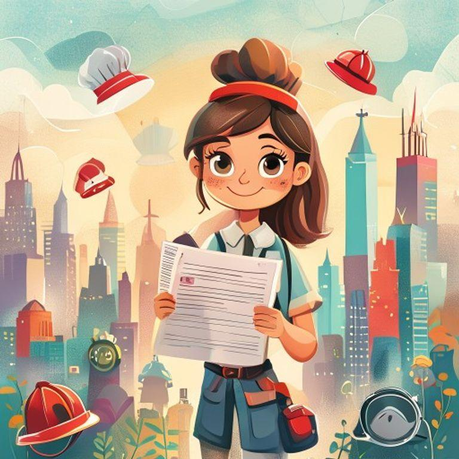
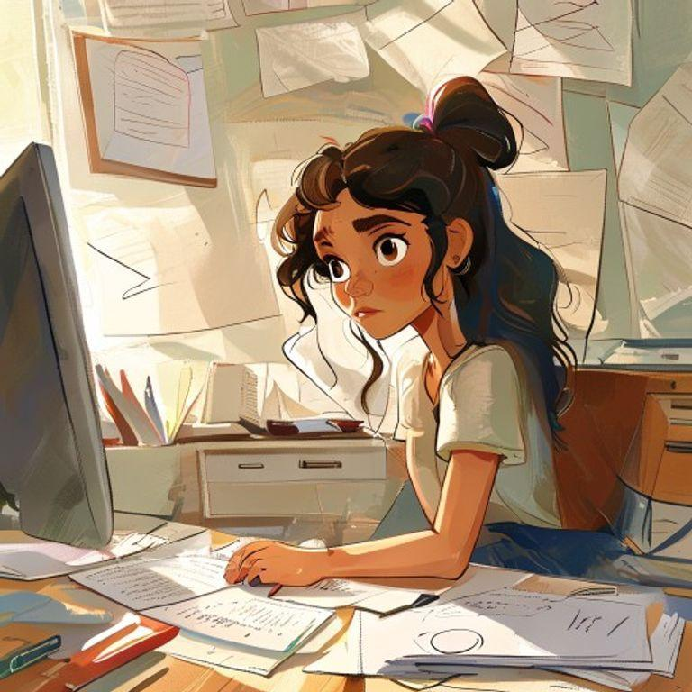
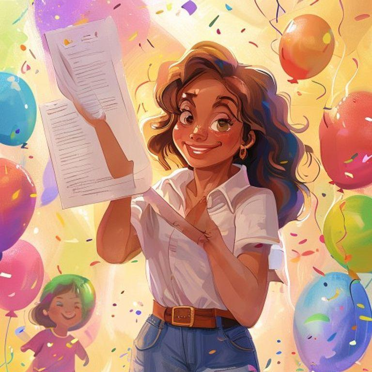
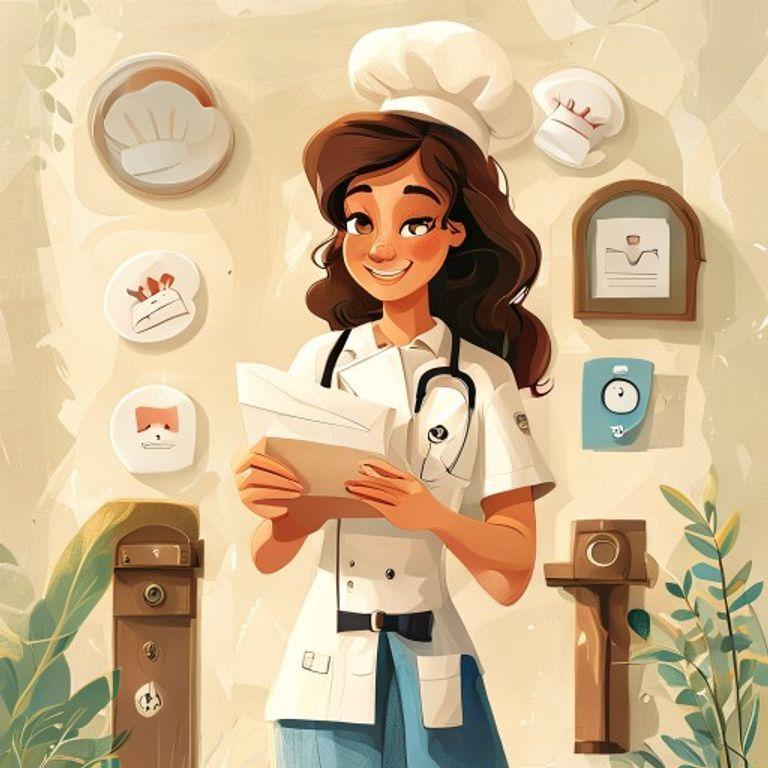
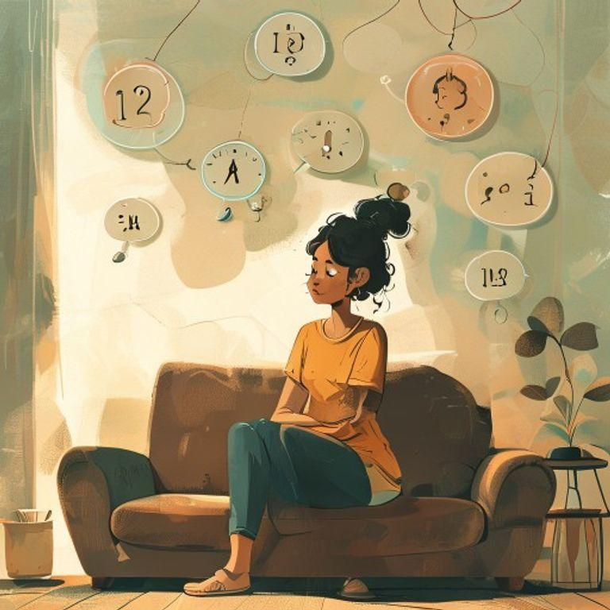

# The Brave Girl's Resume Revolution

## Page 1

Meet Maya, a brave and ambitious girl who lived in a bustling city. She loved trying new things and dreamed of having the most amazing job ever.

## Page 2

One day, Maya decided to create a resume that would show the world all her skills and talents. She sat down at her desk, picked up a pen, and started writing.

## Page 3

Maya wrote about her experience as a volunteer at the local animal shelter, where she helped care for cats and dogs. She also mentioned her skills in baking and cooking, which she learned from her grandmother.

## Page 4

As Maya continued to write, she realized that she had so many more skills and experiences to share. She wrote about her love of reading and writing, and her talent for public speaking.

## Page 5

When Maya finished her resume, she felt proud and confident. She knew that she had created something special, something that would show the world who she was and what she could do.

## Page 6

Maya decided to share her resume with the world, and she started applying for jobs and internships. She was excited to see where her skills and talents would take her.

## Page 7

As Maya waited to hear back from her applications, she felt a sense of anticipation and excitement. She knew that her resume was special, and she was eager to see where it would take her.

## Page 8

And then, the phone rang. Maya answered it, and on the other end was a job offer that would change her life forever. She had done it – she had created a resume that truly reflected her brave and ambitious spirit.

