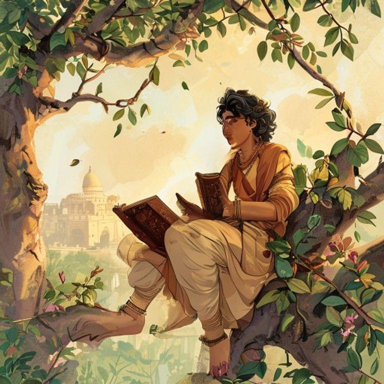
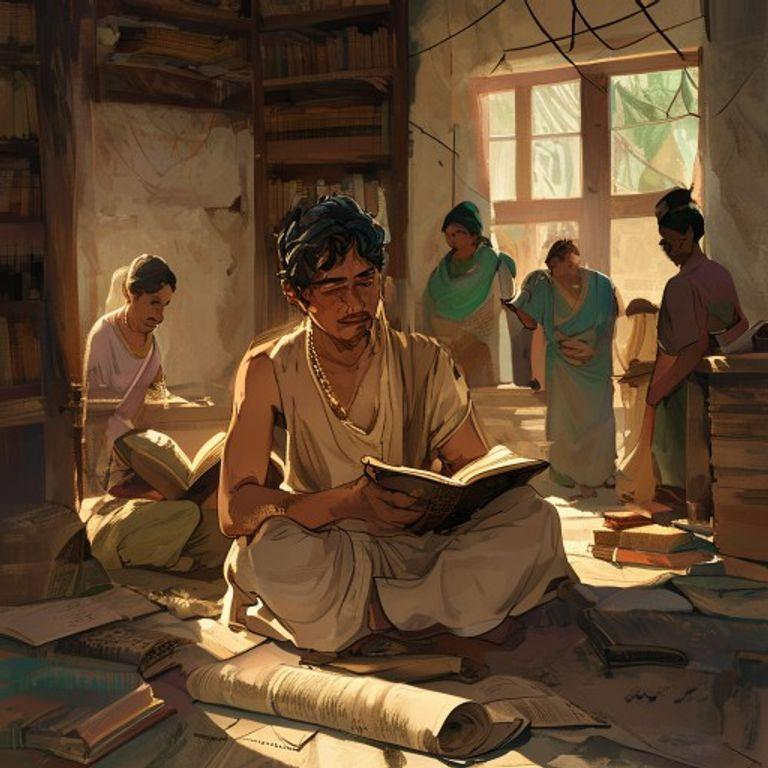
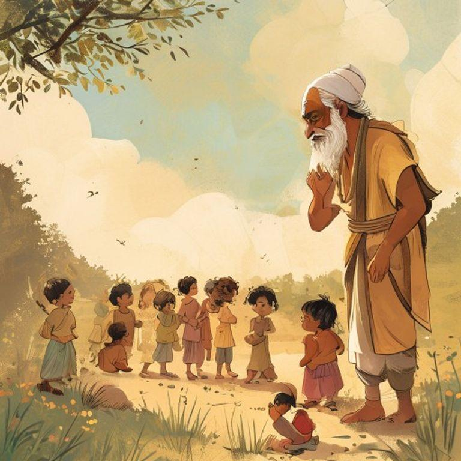
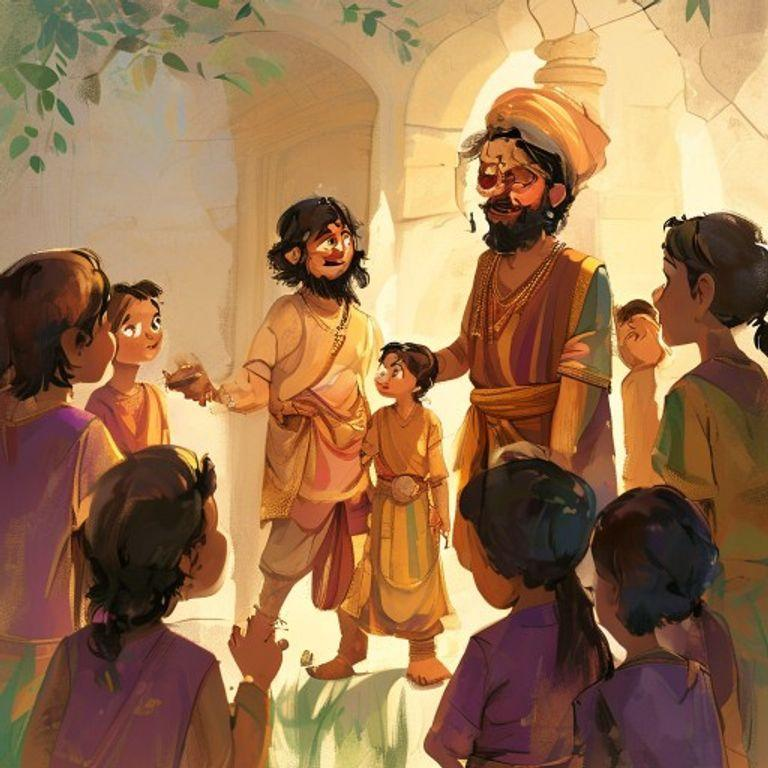
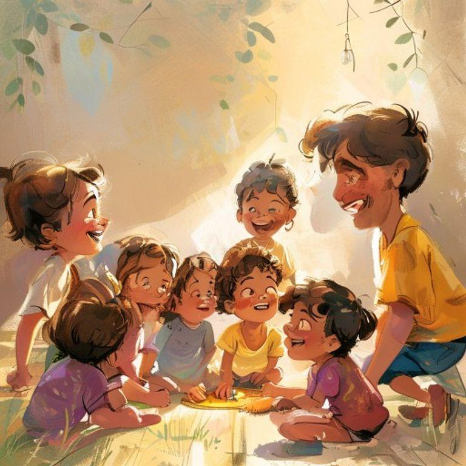
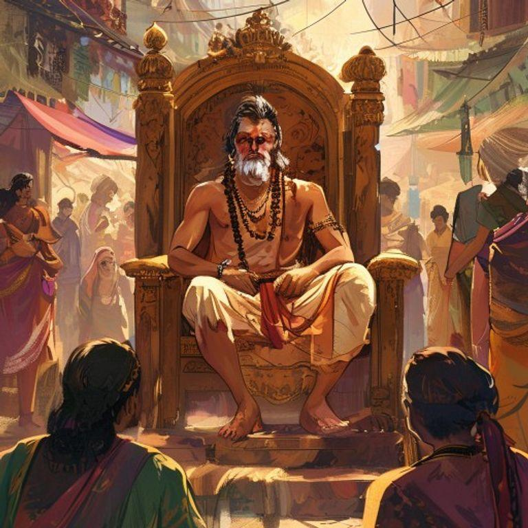
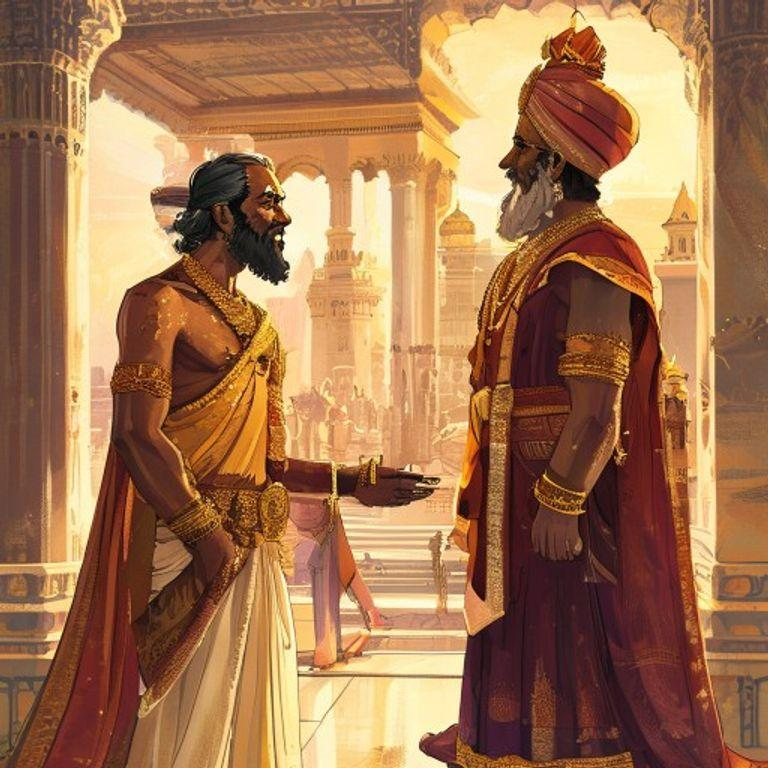
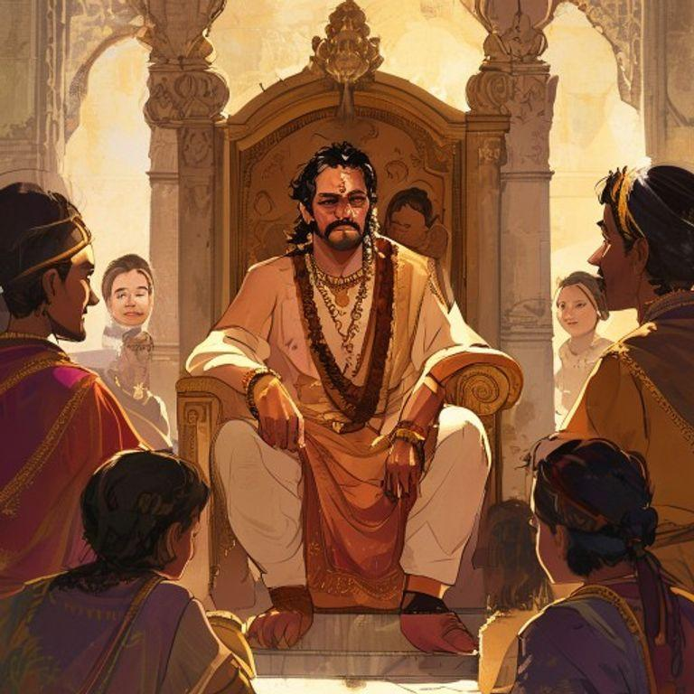
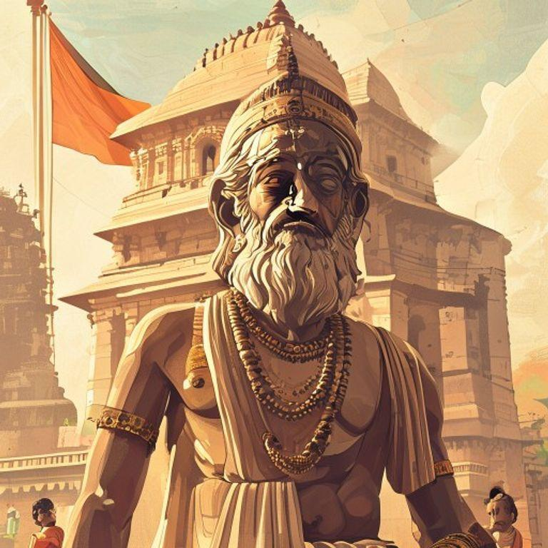

# The Young Strategist: Chanakya's Big Idea

## Page 1

In the ancient Indian city of Magadha, there lived a young boy named Chanakya. He was known for his sharp mind and curious nature. Chanakya loved to read and learn new things, and he spent most of his days studying the scriptures and observing the people around him.

## Page 2

One day, while Chanakya was out for a walk, he saw a group of children playing together. They were laughing and having a great time, but Chanakya noticed that one of the children was being left out. The child was shy and didn't know how to join in.

## Page 3

Chanakya decided to help the shy child. He walked up to the group and suggested a game that would include everyone. The children were hesitant at first, but Chanakya's idea was so good that they all agreed to play along.

## Page 4

The game was a huge success, and all the children had a wonderful time. The shy child was no longer left out, and everyone was happy. Chanakya realized that with a little bit of creativity and strategy, he could make a big difference in people's lives.

## Page 5

From that day on, Chanakya became known as the 'Young Strategist.' People would come to him for advice on how to solve problems and make difficult decisions. Chanakya's big idea had changed his life and the lives of those around him.

## Page 6

Years later, Chanakya's ideas and strategies would help shape the course of Indian history. He would become a trusted advisor to the great emperor Chandragupta Maurya and help him build a powerful and prosperous empire.

## Page 7

But even as a great leader, Chanakya never forgot the shy child he had helped all those years ago. He always remembered the power of a big idea and the impact it could have on people's lives.

## Page 8

And so, Chanakya's legacy lived on, inspiring generations to come. His big idea had changed the course of history, and his story would be remembered forever as a testament to the power of creativity and strategy.

