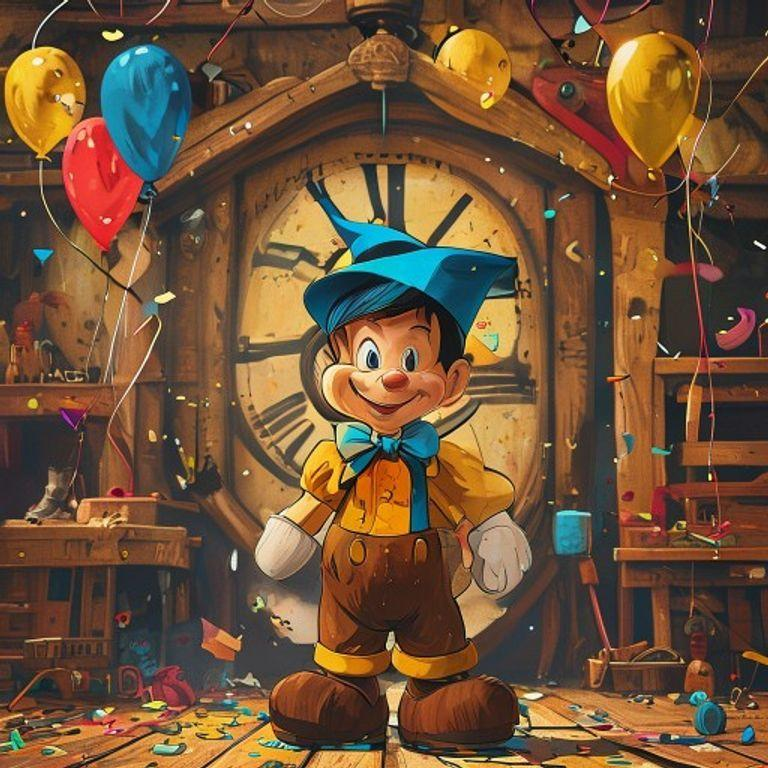
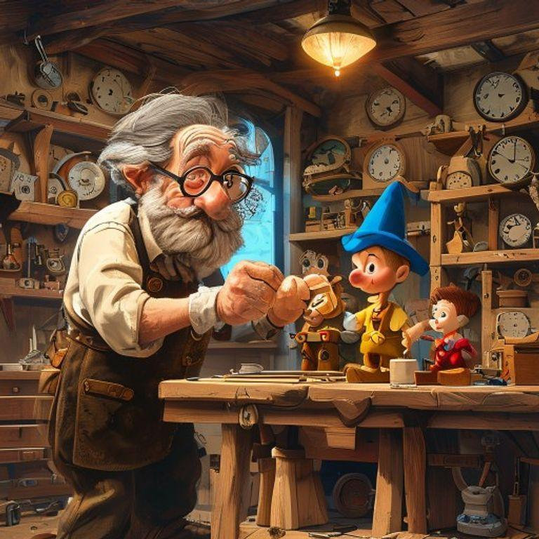
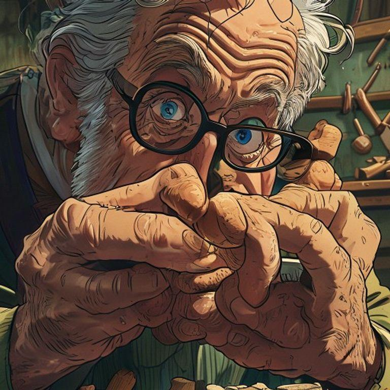
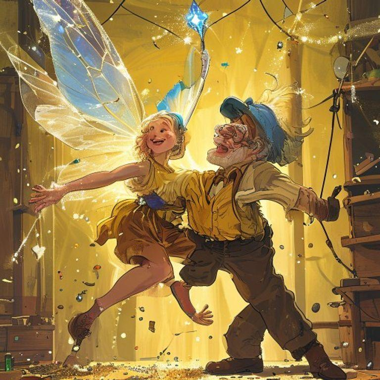
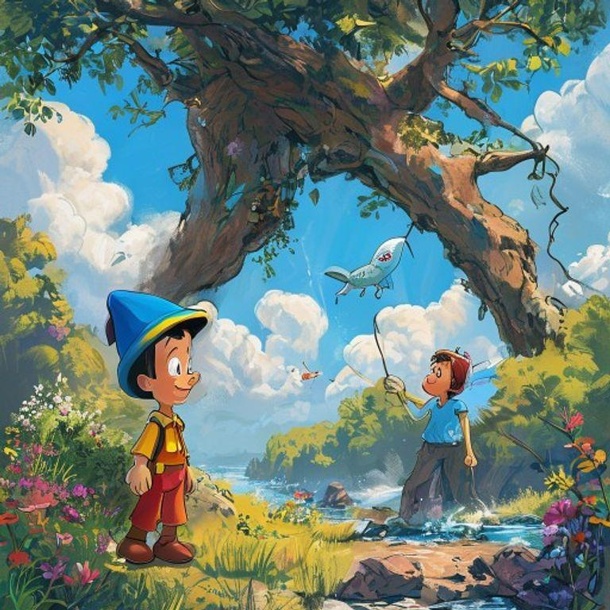
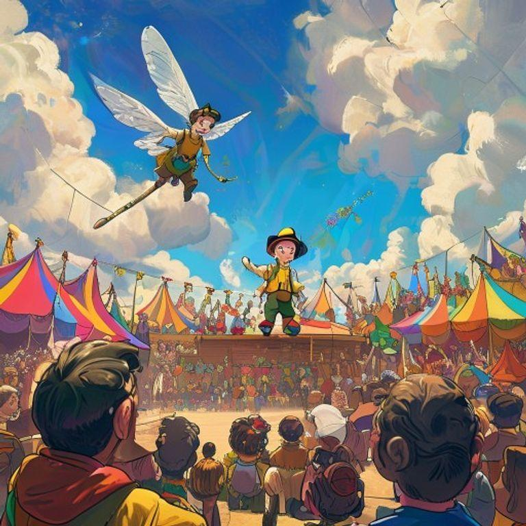
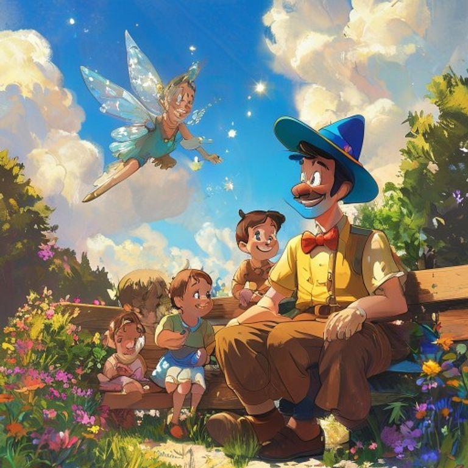
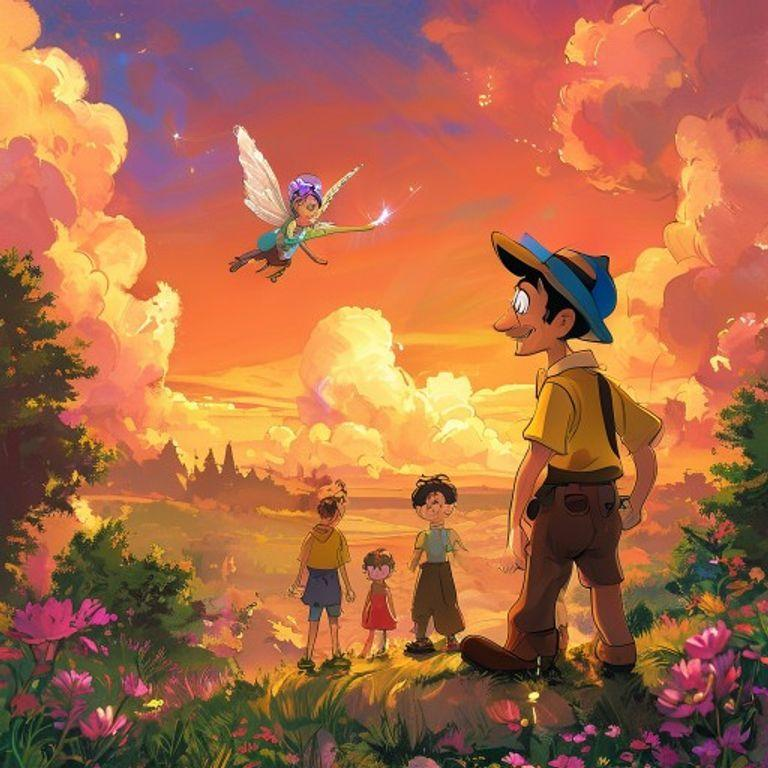
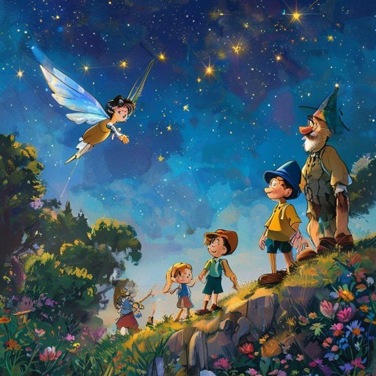

# The Wooden Wonder: A Pinocchio Tale

## Page 1

In a small workshop, filled with the sweet scent of freshly cut wood and the sound of hammering, a brilliant inventor, Geppetto, with his wild grey hair, thick round glasses, and worn leather apron, was busy creating his latest masterpiece. He was making a wooden puppet, Pinocchio, with a curious expression, a small nose, and a mischievous glint in his eye.

## Page 2

As Geppetto worked, he whispered to Pinocchio, 'You will be the most wonderful puppet in all the land! You will dance, and sing, and make everyone laugh!' Pinocchio's wooden limbs began to twitch, and his eyes sparkled with excitement. He couldn't wait to come to life and perform for the world.

## Page 3

One day, a magical fairy, with delicate wings, and a wand made of a sparkling crystal, flew into the workshop. She waved her wand, and Pinocchio's wooden limbs began to move on their own! He jumped, and danced, and sang a happy tune. Geppetto was overjoyed, and hugged his beloved puppet tightly.

## Page 4

But, as Pinocchio explored the world, he began to tell little lies. His nose grew longer, and longer, and longer! He told a lie about catching a giant fish, and his nose grew so long, it got tangled in a tree! The fairy appeared, and scolded Pinocchio, 'A lie is like a weed, it will grow, and grow, and choke out the truth!' Pinocchio promised to always tell the truth, and the fairy helped him to trim his nose back to its normal size.

## Page 5

Pinocchio learned a valuable lesson, and from then on, he always told the truth. He became known as the most honest puppet in all the land! People came from far, and wide, to hear him tell stories, and sing songs. Geppetto was so proud of his beloved puppet, and the magical fairy became Pinocchio's closest friend, and guide.

## Page 6

As the years passed, Pinocchio became a real boy! He grew up, and had children of his own, and told them stories of his adventures as a wooden puppet. The magical fairy remained his closest friend, and guide, and Geppetto remained his beloved father figure. Pinocchio never forgot the lessons he learned as a puppet, and always told the truth, and was kind to all those around him.

## Page 7

And so, Pinocchio lived happily ever after, as a real boy, with a heart full of love, and a spirit full of wonder. He never forgot his magical adventures as a wooden puppet, and always remembered the lessons he learned along the way. The end.

## Page 8

The story of Pinocchio teaches us that honesty is the most important virtue, and that kindness, and love, can conquer all. We can all learn from Pinocchio's adventures, and remember to always tell the truth, and be kind to those around us.

