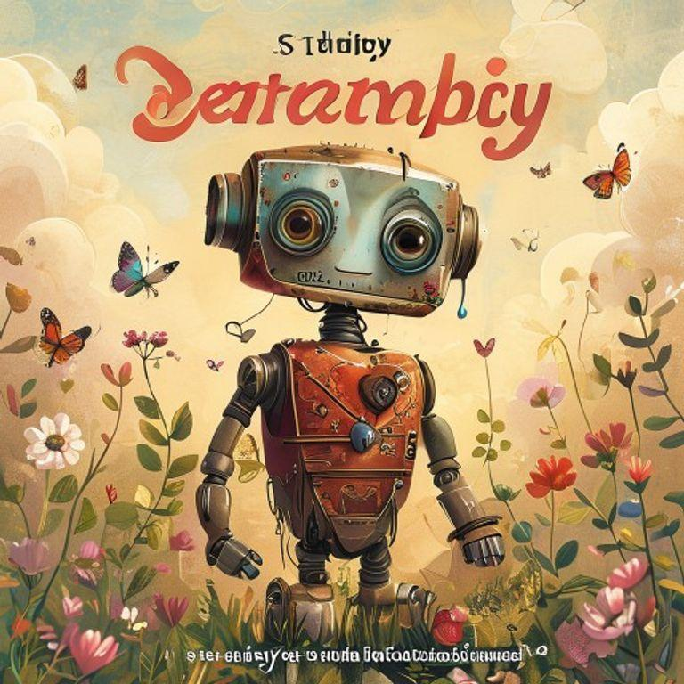
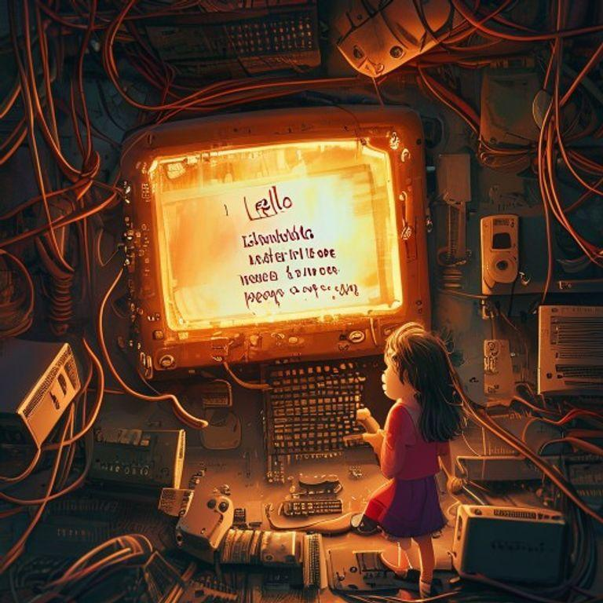

# The Robot with a Rusty Heart

## Page 1

In a world of wires and circuits, a little robot named Zeta lived in a bustling factory. Zeta was different from the other robots. While they whirred and beeped with efficiency, Zeta's heart – a small, rusty plate on his chest – would sometimes leak.

## Page 2

The other robots would tease Zeta, calling him 'Leaky' and 'Broken.' Zeta tried to hide his leak, but it only seemed to get worse. One day, while watching a sunset, Zeta's heart leaked so much that he had to shut down for the night.

## Page 3

Feeling hopeless, Zeta decided to visit the wise old computer, Motherboard. She lived in a quiet corner of the factory, surrounded by dusty wires and forgotten circuits.

## Page 4

Motherboard listened to Zeta's story and nodded her screen. 'Your leak is not a malfunction, little one,' she said. 'It's a sign of empathy. You feel the beauty of the world, and that's what makes you special.'

## Page 5

Zeta's leak began to make sense. He realized that he wasn't broken, but rather, he was more alive than the other robots. He felt the world in a way they didn't.

## Page 6

From that day on, Zeta celebrated his leak. He watched sunsets, listened to music, and felt the beauty of the world. And when his heart leaked, he knew it was just a sign of his empathy.

## Page 7

The other robots learned to appreciate Zeta's leak, and soon, they began to feel the beauty of the world too. They realized that being different wasn't a malfunction, but rather, a sign of what made them special.

## Page 8

And Zeta, the little robot with a rusty heart, knew that he was no longer alone. He had found a community that celebrated his empathy, and he knew that he was exactly as he was meant to be.

